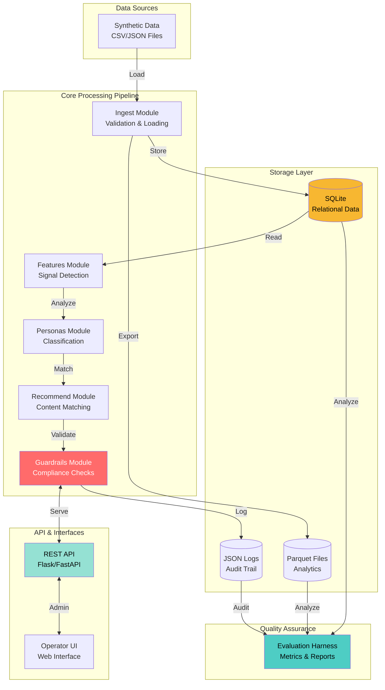
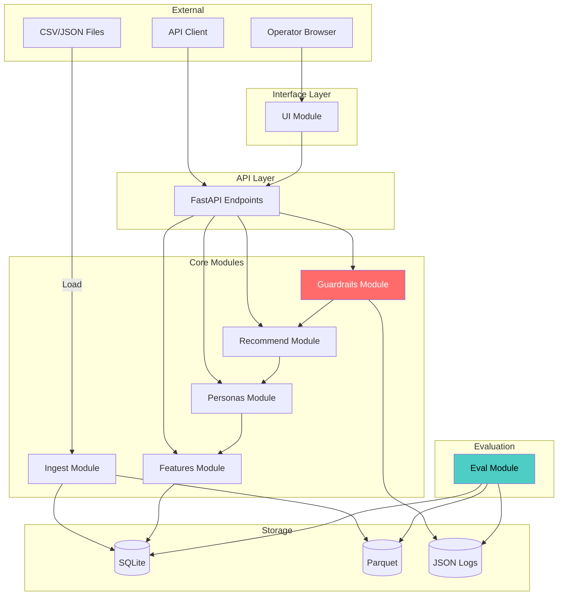

# SpendSense Fullstack Architecture Document

**Version:** 1.0
**Author:** Winston (Architect)
**Last Updated:** November 3, 2025

---

## Change Log

| Date | Version | Description | Author |
|------|---------|-------------|--------|
| 2025-11-03 | 1.0 | Initial architecture document from PRD specifications | Winston (Architect) |

---

## Key Design Decisions

This architecture reflects the following key technical decisions made during design:

1. **Operator UI: React SPA**
   - Technology: React 18 + Vite + TypeScript + TailwindCSS
   - Rationale: Rich interactive experience for filtering, sorting, and real-time updates in operator review workflows
   - Component library: shadcn/ui or Material-UI

2. **Personas: 6 Total (Extended from Original 4)**
   - Original: High Credit Utilization, Subscription-Heavy, Low Savings, Irregular Income
   - Added #5: **Cash Flow Optimizer** - High liquidity users with opportunity for better allocation
   - Added #6: **Young Professional** - Limited transaction history, building financial foundation
   - Rationale: Provides coverage from early-career users to optimization opportunities

3. **Error Handling: Hybrid Strategy**
   - **Development/Testing Mode:** Fail fast for quick bug detection
   - **Production API Mode:** Graceful degradation for individual requests
   - **Batch Processing Mode:** Retry with exponential backoff and fallbacks
   - Rationale: Context-aware strategy maximizes data quality in dev, resilience in production

4. **Authentication: Simple API Key (with OAuth2 Upgrade Path)**
   - Current: Shared API key via X-API-Key header
   - Rationale: PRD states "operator-only access; no user auth needed for synthetic data demo"
   - Auditability satisfied: Decision traces track AI explanations, not individual operators
   - Upgrade path documented: Can migrate to OAuth2 (Google/GitHub) for multi-operator production use
   - Implementation time: 30 minutes vs 2-7 hours for alternatives

---

## Introduction

This document outlines the complete architecture for SpendSense, an explainable, consent-aware AI system that transforms Plaid-style transaction data into personalized financial education. It serves as the single source of truth for AI-driven development, ensuring consistency across the entire technology stack.

SpendSense is designed as a **local-first, cloud-portable** system that prioritizes **transparency, user control, and ethical compliance** in financial AI. Every architectural decision supports the core principles of explainability over sophistication, user control over automation, and education over sales.

### Starter Template or Existing Project

**Status:** N/A - Greenfield Python project

This is a new application designed from scratch to meet specific requirements for explainable financial AI with strict ethical guardrails. No starter template is used, allowing optimization for auditability, transparency, and local-first development.

---

## High-Level Architecture

### Technical Summary

SpendSense employs a **modular monolith architecture** built in Python, with clear module boundaries supporting potential future microservices extraction. The system uses **SQLite** for relational data storage and **Parquet** for analytics workloads, providing a lightweight local-first deployment that runs on a laptop without external dependencies. A **REST API** (Flask/FastAPI) exposes behavioral profiles and recommendations, while a simple **operator web interface** enables human oversight and decision review. The architecture achieves the PRD's core goals through:

- **Explainability:** Every recommendation includes transparent rationales citing specific data signals
- **Auditability:** Complete decision traces logged for all persona assignments and recommendations
- **Ethical Compliance:** Mandatory guardrails enforce consent, eligibility, and tone requirements
- **Local-first Design:** Runs entirely on local machine with <5 second latency target
- **Cloud Portability:** Modular design supports future AWS/GCP deployment without redesign

### Platform and Infrastructure Choice

**Platform:** Local-first development with cloud-portable architecture

**Development Environment:**
- Local laptop (Mac/Linux/Windows)
- Python 3.10+ runtime
- SQLite (bundled with Python)
- Local file system for Parquet/JSON storage

**Future Cloud Deployment Options:**
- **AWS:** Lambda (API), RDS/Aurora (database), S3 (Parquet storage), API Gateway
- **GCP:** Cloud Functions (API), Cloud SQL (database), Cloud Storage (Parquet)
- **Azure:** Functions (API), Azure SQL (database), Blob Storage (Parquet)

**Key Services (Local Development):**
- SQLite database engine (embedded)
- Flask or FastAPI for REST API
- Simple web server for operator UI (Flask templates or static React app)
- Parquet file storage on local filesystem

**Deployment Regions:** Initially local; future US regions for compliance

### Repository Structure

**Structure:** Monorepo (single Python package with clear module boundaries)

**Package Organization:**
```
spendsense/
├── ingest/          # Data loading and validation modules
├── features/        # Signal detection and feature engineering
├── personas/        # Persona assignment logic
├── recommend/       # Recommendation engine
├── guardrails/      # Consent, eligibility, tone checks
├── ui/              # Operator view and user interface
├── eval/            # Evaluation harness and metrics
└── api/             # REST API endpoints
```

**Rationale:** Simple monorepo avoids complexity of multi-repo coordination while maintaining clear boundaries. Can add Poetry or pip-tools for dependency management if needed.

### High-Level Architecture Diagram



### Architectural Patterns

- **Modular Monolith:** Single deployment unit with clear module boundaries - _Rationale:_ Simplifies development and deployment for 50-100 user scale while enabling future service extraction if needed

- **Pipeline Architecture:** Sequential data flow through ingest → features → personas → recommendations → guardrails - _Rationale:_ Matches natural processing stages and ensures complete audit trail for every decision

- **Repository Pattern:** Abstract data access behind clean interfaces - _Rationale:_ Enables comprehensive unit testing and potential database migration (e.g., SQLite → PostgreSQL for production)

- **Strategy Pattern:** Pluggable persona definitions and recommendation rules - _Rationale:_ Supports extensibility for custom Persona 5 and future persona additions without core logic changes

- **Decorator/Middleware Pattern:** Guardrails wrap recommendation generation - _Rationale:_ Transparently enforces consent, eligibility, and tone checks without polluting business logic

- **Command Pattern:** API endpoints trigger processing pipelines with clear inputs/outputs - _Rationale:_ Separates HTTP concerns from domain logic, enabling testing without web framework

- **Hybrid Error Handling:** Context-aware error strategies - _Rationale:_ Fail fast in development/testing for quick bug detection, graceful degradation for production API requests, retry with fallbacks for batch processing to maximize coverage

---

## Tech Stack

This is the **definitive technology selection** for the entire project. All development must use these exact versions and tools.

| Category | Technology | Version | Purpose | Rationale |
|----------|-----------|---------|---------|-----------|
| **Backend Language** | Python | 3.10+ | Core application logic, data processing | Excellent data science libraries (pandas, numpy), strong typing support, readable for financial domain logic |
| **Backend Framework** | FastAPI | 0.104+ | REST API server | Auto-generates OpenAPI docs, async support, type validation via Pydantic, faster than Flask for data-heavy operations |
| **API Style** | REST | OpenAPI 3.0 | Client-server communication | Simple, well-understood, easy to document and test; no need for GraphQL complexity with straightforward CRUD operations |
| **Database** | SQLite | 3.40+ | Relational data storage | Zero-configuration, bundled with Python, perfect for local-first development, easy migration to PostgreSQL later |
| **Analytics Storage** | Parquet | via pyarrow 10+ | Columnar analytics data | Efficient for time-series queries, compact storage, standard format for data science tools |
| **Data Validation** | Pydantic | 2.5+ | Schema validation, type safety | Tight integration with FastAPI, comprehensive validation, auto-generates JSON schemas |
| **Data Processing** | pandas | 2.1+ | DataFrame operations, signal detection | Industry standard for financial data analysis, efficient time-window aggregations |
| **Synthetic Data** | Faker | 20+ | Realistic fake data generation | Rich providers for names, addresses, financial data; deterministic seeding for reproducibility |
| **File Storage** | Local Filesystem | - | Config files, logs, Parquet | Simple, no dependencies, works offline |
| **Configuration** | YAML/JSON | pyyaml 6.0+ | Persona registry, content catalog | Human-readable, supports comments (YAML), easy to validate |
| **Logging** | Python logging + structlog | 23+ | Structured audit logs | Structured JSON logging for audit trails, integrates with standard Python logging |
| **Authentication** | API Key (Header) | - | Operator authentication | Simple API key authentication via X-API-Key header; satisfies demo requirements; can upgrade to OAuth2 for multi-operator production use |
| **Backend Testing** | pytest | 7.4+ | Unit and integration tests | Rich plugin ecosystem, fixtures for data setup, parametrized testing for signal detection edge cases |
| **Test Coverage** | pytest-cov | 4.1+ | Code coverage measurement | Ensures ≥10 tests requirement met, identifies untested code paths |
| **Frontend (Operator UI)** | React | 18+ | Interactive operator dashboard | Rich SPA experience for filtering, sorting, real-time updates in review workflows |
| **Frontend Build Tool** | Vite | 5+ | Fast React development | Lightning-fast HMR, optimized production builds, simple configuration |
| **UI Component Library** | shadcn/ui or MUI | Latest | React components | Pre-built accessible components, consistent design system |
| **Frontend Styling** | TailwindCSS | 3+ | Utility-first CSS | Rapid UI development, responsive design, small bundle size |
| **Frontend State Management** | React Query | 5+ | Server state management | Automatic caching, refetching, optimistic updates for API data |
| **Frontend Routing** | React Router | 6+ | Client-side routing | SPA navigation, protected routes for operator authentication |
| **E2E Testing** | pytest + requests | - | API integration tests | Test full pipeline from API → database → response without separate E2E framework |
| **Linting** | ruff | 0.1+ | Fast Python linter | Extremely fast, combines functionality of flake8, isort, and more |
| **Formatting** | black | 23+ | Code formatting | Opinionated, deterministic, reduces formatting debates |
| **Type Checking** | mypy | 1.7+ | Static type analysis | Catches type errors early, documents interfaces via type hints |
| **Build Tool** | pip + requirements.txt | - | Dependency management | Simple, standard, one-command setup (`pip install -r requirements.txt`) |
| **Virtual Environment** | venv | built-in | Isolated dependencies | Built into Python 3, no extra tools needed |
| **CI/CD** | GitHub Actions | - | Automated testing and deployment | Free for open source, easy YAML config, integrates with GitHub |
| **Monitoring (Future)** | Prometheus + Grafana | - | Metrics and dashboards | Industry standard, cloud-portable, supports custom metrics |
| **Logging (Future)** | ELK Stack or CloudWatch | - | Centralized log aggregation | For production deployment; local logs sufficient initially |

---

## Data Models

Based on the PRD requirements and Plaid data structure, here are the core domain models:

### User

**Purpose:** Represents a synthetic user with financial accounts and consent status

**Key Attributes:**
- `user_id`: str (UUID) - Unique identifier
- `name`: str - Synthetic name (from Faker)
- `created_at`: datetime - User creation timestamp
- `consent_status`: enum (opted_in, opted_out) - Consent state
- `consent_timestamp`: datetime - When consent was granted/revoked
- `consent_version`: str - Version of consent terms accepted

**TypeScript Interface:**
```typescript
interface User {
  user_id: string;
  name: string;
  created_at: string; // ISO 8601
  consent_status: 'opted_in' | 'opted_out';
  consent_timestamp: string; // ISO 8601
  consent_version: string;
}
```

**Relationships:**
- Has many Accounts (1:N)
- Has many Transactions (1:N via Accounts)
- Has many Liabilities (1:N)
- Has many BehavioralSignals (1:N)
- Has many PersonaAssignments (1:N, by time window)
- Has many Recommendations (1:N)

---

### Account

**Purpose:** Plaid-style account (checking, savings, credit card, etc.)

**Key Attributes:**
- `account_id`: str (UUID) - Unique identifier
- `user_id`: str (foreign key) - Owner
- `type`: enum (depository, credit, loan) - Account category
- `subtype`: enum (checking, savings, credit_card, money_market, hsa, mortgage, student) - Specific type
- `balance_available`: Decimal - Available balance
- `balance_current`: Decimal - Current balance
- `balance_limit`: Decimal (nullable) - Credit limit (credit cards only)
- `iso_currency_code`: str - Currency (e.g., "USD")
- `holder_category`: enum (personal, business) - Exclude business accounts

**TypeScript Interface:**
```typescript
interface Account {
  account_id: string;
  user_id: string;
  type: 'depository' | 'credit' | 'loan';
  subtype: 'checking' | 'savings' | 'credit_card' | 'money_market' | 'hsa' | 'mortgage' | 'student';
  balance_available: number;
  balance_current: number;
  balance_limit: number | null;
  iso_currency_code: string;
  holder_category: 'personal' | 'business';
}
```

**Relationships:**
- Belongs to User (N:1)
- Has many Transactions (1:N)

---

### Transaction

**Purpose:** Individual financial transaction (purchase, transfer, payment, deposit)

**Key Attributes:**
- `transaction_id`: str (UUID) - Unique identifier
- `account_id`: str (foreign key) - Related account
- `date`: date - Transaction date
- `amount`: Decimal - Transaction amount (negative = debit, positive = credit)
- `merchant_name`: str (nullable) - Merchant name
- `merchant_entity_id`: str (nullable) - Canonical merchant ID
- `payment_channel`: enum (online, in_store, other) - Channel
- `category_primary`: str - Primary category (e.g., "Food and Drink")
- `category_detailed`: str - Detailed category (e.g., "Restaurants")
- `pending`: bool - Whether transaction is pending

**TypeScript Interface:**
```typescript
interface Transaction {
  transaction_id: string;
  account_id: string;
  date: string; // YYYY-MM-DD
  amount: number;
  merchant_name: string | null;
  merchant_entity_id: string | null;
  payment_channel: 'online' | 'in_store' | 'other';
  category_primary: string;
  category_detailed: string;
  pending: boolean;
}
```

**Relationships:**
- Belongs to Account (N:1)
- Belongs to User (N:1 via Account)

---

### Liability

**Purpose:** Credit card or loan details (APR, payment info, overdue status)

**Key Attributes:**
- `liability_id`: str (UUID) - Unique identifier
- `account_id`: str (foreign key) - Related credit/loan account
- `liability_type`: enum (credit_card, mortgage, student_loan) - Type
- `apr_percentage`: Decimal (nullable) - Annual percentage rate
- `apr_type`: str (nullable) - APR type (e.g., "purchase_apr", "cash_advance_apr")
- `minimum_payment_amount`: Decimal (nullable) - Minimum payment due
- `last_payment_amount`: Decimal (nullable) - Last payment made
- `last_statement_balance`: Decimal (nullable) - Last statement balance
- `is_overdue`: bool - Whether account is overdue
- `next_payment_due_date`: date (nullable) - Next payment due
- `interest_rate`: Decimal (nullable) - Interest rate (for mortgages/loans)

**TypeScript Interface:**
```typescript
interface Liability {
  liability_id: string;
  account_id: string;
  liability_type: 'credit_card' | 'mortgage' | 'student_loan';
  apr_percentage: number | null;
  apr_type: string | null;
  minimum_payment_amount: number | null;
  last_payment_amount: number | null;
  last_statement_balance: number | null;
  is_overdue: boolean;
  next_payment_due_date: string | null; // YYYY-MM-DD
  interest_rate: number | null;
}
```

**Relationships:**
- Belongs to Account (1:1)
- Belongs to User (N:1 via Account)

---

### BehavioralSignal

**Purpose:** Computed financial behavior signals (subscriptions, savings, credit, income)

**Key Attributes:**
- `signal_id`: str (UUID) - Unique identifier
- `user_id`: str (foreign key) - User
- `time_window`: enum (30_day, 180_day) - Analysis window
- `computed_at`: datetime - When signals were calculated
- `subscription_recurring_merchants`: int - Count of recurring merchants
- `subscription_monthly_spend`: Decimal - Monthly recurring spend
- `subscription_share_pct`: Decimal - Subscription share of total spend
- `savings_net_inflow`: Decimal - Net inflow to savings accounts
- `savings_growth_rate_pct`: Decimal - Savings growth rate
- `savings_emergency_fund_months`: Decimal - Emergency fund coverage in months
- `credit_max_utilization_pct`: Decimal - Highest card utilization
- `credit_has_interest_charges`: bool - Whether interest charges detected
- `credit_minimum_payment_only`: bool - Whether only minimum payments detected
- `credit_overdue_status`: bool - Whether any account overdue
- `income_payroll_count`: int - Count of payroll deposits
- `income_median_pay_gap_days`: Decimal - Median days between paychecks
- `income_cash_flow_buffer_months`: Decimal - Cash flow buffer in months

**TypeScript Interface:**
```typescript
interface BehavioralSignal {
  signal_id: string;
  user_id: string;
  time_window: '30_day' | '180_day';
  computed_at: string; // ISO 8601
  // Subscription signals
  subscription_recurring_merchants: number;
  subscription_monthly_spend: number;
  subscription_share_pct: number;
  // Savings signals
  savings_net_inflow: number;
  savings_growth_rate_pct: number;
  savings_emergency_fund_months: number;
  // Credit signals
  credit_max_utilization_pct: number;
  credit_has_interest_charges: boolean;
  credit_minimum_payment_only: boolean;
  credit_overdue_status: boolean;
  // Income signals
  income_payroll_count: number;
  income_median_pay_gap_days: number;
  income_cash_flow_buffer_months: number;
}
```

**Relationships:**
- Belongs to User (N:1)
- Referenced by PersonaAssignment (1:1 per window)

---

### PersonaAssignment

**Purpose:** Assigned persona based on behavioral signals with complete audit trail

**Key Attributes:**
- `assignment_id`: str (UUID) - Unique identifier
- `user_id`: str (foreign key) - User
- `signal_id`: str (foreign key) - Signals used for assignment
- `time_window`: enum (30_day, 180_day) - Analysis window
- `assigned_persona_id`: str - Selected persona (e.g., "high_utilization")
- `assigned_at`: datetime - Assignment timestamp
- `qualifying_personas`: JSON - List of all personas that matched criteria
- `match_evidence`: JSON - Signal values that triggered each match
- `prioritization_reason`: str - Why this persona was selected over others

**TypeScript Interface:**
```typescript
interface PersonaAssignment {
  assignment_id: string;
  user_id: string;
  signal_id: string;
  time_window: '30_day' | '180_day';
  assigned_persona_id: string;
  assigned_at: string; // ISO 8601
  qualifying_personas: string[]; // e.g., ["high_utilization", "subscription_heavy"]
  match_evidence: Record<string, any>; // Signal values that matched
  prioritization_reason: string;
}
```

**Relationships:**
- Belongs to User (N:1)
- References BehavioralSignal (N:1)
- Referenced by Recommendations (1:N)

---

### Recommendation

**Purpose:** Generated education items and partner offers with transparent rationales

**Key Attributes:**
- `recommendation_id`: str (UUID) - Unique identifier
- `user_id`: str (foreign key) - User
- `assignment_id`: str (foreign key) - Persona assignment used
- `content_id`: str - ID from content catalog
- `content_type`: enum (education, partner_offer) - Type
- `content_title`: str - Display title
- `content_summary`: str - Plain-language description
- `rationale`: str - "Because..." explanation citing specific data
- `generated_at`: datetime - When recommendation was created
- `guardrail_status`: enum (pass, consent_fail, eligibility_fail, tone_fail) - Validation result
- `operator_status`: enum (pending, approved, overridden, flagged) - Operator decision
- `operator_decision_at`: datetime (nullable) - When operator reviewed
- `operator_notes`: str (nullable) - Operator justification

**TypeScript Interface:**
```typescript
interface Recommendation {
  recommendation_id: string;
  user_id: string;
  assignment_id: string;
  content_id: string;
  content_type: 'education' | 'partner_offer';
  content_title: string;
  content_summary: string;
  rationale: string;
  generated_at: string; // ISO 8601
  guardrail_status: 'pass' | 'consent_fail' | 'eligibility_fail' | 'tone_fail';
  operator_status: 'pending' | 'approved' | 'overridden' | 'flagged';
  operator_decision_at: string | null;
  operator_notes: string | null;
}
```

**Relationships:**
- Belongs to User (N:1)
- References PersonaAssignment (N:1)

---

## API Specification

**API Style:** REST API (OpenAPI 3.0)

```yaml
openapi: 3.0.0
info:
  title: SpendSense API
  version: 1.0.0
  description: REST API for SpendSense financial insights and recommendations system
  contact:
    email: bharris@peak6.com

servers:
  - url: http://localhost:8000/api/v1
    description: Local development server
  - url: https://api.spendsense.example.com/v1
    description: Production server (future)

security:
  - ApiKeyAuth: []

paths:
  /users:
    post:
      summary: Create synthetic user
      tags: [Users]
      requestBody:
        required: true
        content:
          application/json:
            schema:
              type: object
              properties:
                name:
                  type: string
                  example: "Jane Doe"
      responses:
        '201':
          description: User created
          content:
            application/json:
              schema:
                $ref: '#/components/schemas/User'
        '400':
          description: Invalid request

  /consent:
    post:
      summary: Record user consent
      tags: [Consent]
      requestBody:
        required: true
        content:
          application/json:
            schema:
              type: object
              required:
                - user_id
                - consent_status
              properties:
                user_id:
                  type: string
                  format: uuid
                consent_status:
                  type: string
                  enum: [opted_in, opted_out]
                consent_version:
                  type: string
                  example: "1.0"
      responses:
        '200':
          description: Consent recorded
        '404':
          description: User not found

  /consent/{user_id}:
    get:
      summary: Get user consent status
      tags: [Consent]
      parameters:
        - name: user_id
          in: path
          required: true
          schema:
            type: string
            format: uuid
      responses:
        '200':
          description: Consent status
          content:
            application/json:
              schema:
                type: object
                properties:
                  user_id:
                    type: string
                  consent_status:
                    type: string
                    enum: [opted_in, opted_out]
                  consent_timestamp:
                    type: string
                    format: date-time

  /profile/{user_id}:
    get:
      summary: Get user behavioral profile
      tags: [Profiles]
      parameters:
        - name: user_id
          in: path
          required: true
          schema:
            type: string
            format: uuid
        - name: time_window
          in: query
          schema:
            type: string
            enum: [30_day, 180_day]
            default: 30_day
      responses:
        '200':
          description: Behavioral profile with signals and persona
          content:
            application/json:
              schema:
                type: object
                properties:
                  user:
                    $ref: '#/components/schemas/User'
                  signals:
                    $ref: '#/components/schemas/BehavioralSignal'
                  persona_assignment:
                    $ref: '#/components/schemas/PersonaAssignment'
        '403':
          description: Consent not granted
        '404':
          description: User not found

  /recommendations/{user_id}:
    get:
      summary: Get personalized recommendations
      tags: [Recommendations]
      parameters:
        - name: user_id
          in: path
          required: true
          schema:
            type: string
            format: uuid
        - name: time_window
          in: query
          schema:
            type: string
            enum: [30_day, 180_day]
            default: 30_day
      responses:
        '200':
          description: Recommendations with rationales
          content:
            application/json:
              schema:
                type: object
                properties:
                  recommendations:
                    type: array
                    items:
                      $ref: '#/components/schemas/Recommendation'
                  disclaimer:
                    type: string
                    example: "This is educational content, not financial advice. Consult a licensed advisor for personalized guidance."
        '403':
          description: Consent not granted or recommendations blocked by guardrails

  /feedback:
    post:
      summary: Record user feedback on recommendations
      tags: [Feedback]
      requestBody:
        required: true
        content:
          application/json:
            schema:
              type: object
              properties:
                recommendation_id:
                  type: string
                  format: uuid
                feedback_type:
                  type: string
                  enum: [helpful, not_helpful, irrelevant]
                comments:
                  type: string
      responses:
        '200':
          description: Feedback recorded

  /operator/review:
    get:
      summary: Get recommendations pending operator review
      tags: [Operator]
      security:
        - ApiKeyAuth: []
      parameters:
        - name: status
          in: query
          schema:
            type: string
            enum: [pending, flagged]
        - name: limit
          in: query
          schema:
            type: integer
            default: 50
      responses:
        '200':
          description: Recommendations requiring review
          content:
            application/json:
              schema:
                type: array
                items:
                  $ref: '#/components/schemas/Recommendation'

  /operator/review/{recommendation_id}:
    put:
      summary: Operator approve/override/flag recommendation
      tags: [Operator]
      security:
        - ApiKeyAuth: []
      parameters:
        - name: recommendation_id
          in: path
          required: true
          schema:
            type: string
            format: uuid
      requestBody:
        required: true
        content:
          application/json:
            schema:
              type: object
              required:
                - operator_status
              properties:
                operator_status:
                  type: string
                  enum: [approved, overridden, flagged]
                operator_notes:
                  type: string
      responses:
        '200':
          description: Operator decision recorded

components:
  schemas:
    User:
      type: object
      properties:
        user_id:
          type: string
          format: uuid
        name:
          type: string
        created_at:
          type: string
          format: date-time
        consent_status:
          type: string
          enum: [opted_in, opted_out]
        consent_timestamp:
          type: string
          format: date-time
        consent_version:
          type: string

    BehavioralSignal:
      type: object
      properties:
        signal_id:
          type: string
        user_id:
          type: string
        time_window:
          type: string
          enum: [30_day, 180_day]
        computed_at:
          type: string
          format: date-time
        subscription_recurring_merchants:
          type: integer
        subscription_monthly_spend:
          type: number
        subscription_share_pct:
          type: number
        savings_net_inflow:
          type: number
        credit_max_utilization_pct:
          type: number
        # ... (additional signal fields)

    PersonaAssignment:
      type: object
      properties:
        assignment_id:
          type: string
        user_id:
          type: string
        assigned_persona_id:
          type: string
        assigned_at:
          type: string
          format: date-time
        qualifying_personas:
          type: array
          items:
            type: string
        match_evidence:
          type: object
        prioritization_reason:
          type: string

    Recommendation:
      type: object
      properties:
        recommendation_id:
          type: string
        user_id:
          type: string
        content_type:
          type: string
          enum: [education, partner_offer]
        content_title:
          type: string
        content_summary:
          type: string
        rationale:
          type: string
        generated_at:
          type: string
          format: date-time
        guardrail_status:
          type: string
        operator_status:
          type: string

  securitySchemes:
    ApiKeyAuth:
      type: apiKey
      in: header
      name: X-API-Key
      description: |
        Simple API key authentication for operator endpoints.
        Set OPERATOR_API_KEY environment variable.

        **Upgrade Path:** For multi-operator production use, can be replaced with OAuth2
        (Google/GitHub) to enable individual operator tracking and accountability.
```

---


## Components

Based on the modular architecture, here are the detailed component descriptions:

### Ingest Module

**Responsibility:** Load and validate synthetic Plaid-style data from CSV/JSON files

**Key Interfaces:**
- `load_users(file_path) -> List[User]`
- `load_accounts(file_path) -> List[Account]`
- `load_transactions(file_path) -> List[Transaction]`
- `load_liabilities(file_path) -> List[Liability]`
- `validate_schema(data, schema_type) -> ValidationResult`

**Dependencies:** Pydantic (validation), pandas (CSV/JSON reading), SQLite (storage)

**Technology Stack:** Python, Pydantic, pandas, SQLite, Parquet (via pyarrow)

---

### Features Module

**Responsibility:** Detect behavioral signals from financial data over time windows

**Key Interfaces:**
- `detect_subscriptions(user_id, time_window) -> SubscriptionSignals`
- `detect_savings_patterns(user_id, time_window) -> SavingsSignals`
- `detect_credit_behavior(user_id, time_window) -> CreditSignals`
- `detect_income_stability(user_id, time_window) -> IncomeSignals`
- `aggregate_signals(user_id, time_window) -> BehavioralSignal`

**Dependencies:** SQLite (data access), pandas (time-series analysis)

**Technology Stack:** Python, pandas, numpy, SQLite

---

### Personas Module

**Responsibility:** Assign users to personas based on behavioral signals

**Defined Personas (6 total):**
1. **High Credit Utilization** - Credit cards >50% utilized, focus on debt reduction education
2. **Subscription-Heavy Spending** - High recurring merchant spend (>20% of expenses), subscription optimization
3. **Low Savings/Emergency Fund** - Minimal savings buffer (<3 months expenses), emergency fund building
4. **Irregular Income** - Inconsistent payroll patterns, cash flow stability strategies
5. **Cash Flow Optimizer** - High liquidity (≥6 months expenses), minimal debt usage, opportunity for better allocation (high-yield savings, investments, goal planning)
6. **Young Professional / Credit Builder** - Limited transaction history (<6 months), low credit limits, early career, foundational financial education

**Key Interfaces:**
- `load_persona_registry() -> PersonaRegistry`
- `match_personas(signals: BehavioralSignal) -> List[PersonaMatch]`
- `prioritize_persona(matches: List[PersonaMatch]) -> Persona`
- `assign_persona(user_id, time_window) -> PersonaAssignment`

**Dependencies:** Features module (signals), YAML config (persona definitions)

**Technology Stack:** Python, PyYAML, SQLite

**Persona Matching Criteria (Detailed):**

| Persona ID | Key Signals | Thresholds |
|------------|-------------|------------|
| `high_utilization` | `credit_max_utilization_pct` | ≥50% |
| `subscription_heavy` | `subscription_share_pct` | ≥20% of total spend |
| `low_savings` | `savings_emergency_fund_months` | <3 months expenses |
| `irregular_income` | `income_median_pay_gap_days` | High variance (>7 days stddev) or <2 paychecks in 30-day window |
| `cash_flow_optimizer` | `savings_emergency_fund_months` AND `credit_max_utilization_pct` | ≥6 months expenses AND <10% utilization |
| `young_professional` | Transaction history AND `credit` limit | <180 days of transactions AND credit limits <$3000 |

**Prioritization Order:** If user matches multiple personas, assign in order: `high_utilization` > `irregular_income` > `low_savings` > `subscription_heavy` > `cash_flow_optimizer` > `young_professional`

---

### Recommend Module

**Responsibility:** Generate educational recommendations and partner offers

**Key Interfaces:**
- `load_content_catalog() -> ContentCatalog`
- `match_education(persona, signals) -> List[EducationItem]`
- `match_offers(persona, signals, user_profile) -> List[PartnerOffer]`
- `generate_rationale(content, signals) -> str`
- `assemble_recommendations(user_id, time_window) -> List[Recommendation]`

**Dependencies:** Personas module (assignments), YAML config (content catalog)

**Technology Stack:** Python, Jinja2 (rationale templates), PyYAML

---

### Guardrails Module

**Responsibility:** Enforce ethical constraints on recommendations

**Key Interfaces:**
- `check_consent(user_id) -> ConsentStatus`
- `check_eligibility(user_id, offer) -> EligibilityResult`
- `validate_tone(text) -> ToneValidationResult`
- `add_disclaimer(recommendations) -> List[Recommendation]`
- `apply_guardrails(recommendations) -> List[Recommendation]`

**Dependencies:** Recommend module (recommendations), SQLite (consent data)

**Technology Stack:** Python, regex (tone validation), SQLite

---

### UI Module (Operator Interface)

**Responsibility:** Provide web interface for operator oversight

**Key Components:**
- `Dashboard.tsx` - Main operator dashboard with metrics overview
- `UserSignalsView.tsx` - Detailed behavioral signals for individual users
- `RecommendationsQueue.tsx` - Review queue with filtering and sorting
- `RecommendationReview.tsx` - Single recommendation review interface with approve/override/flag actions

**Dependencies:** FastAPI backend (REST API), React Router (navigation), React Query or SWR (data fetching)

**Technology Stack:** React 18, Vite, TypeScript, shadcn/ui or Material-UI, TailwindCSS

---

### Eval Module

**Responsibility:** Measure system performance and generate evaluation reports

**Key Interfaces:**
- `calculate_coverage_metrics() -> CoverageMetrics`
- `calculate_explainability_metrics() -> ExplainabilityMetrics`
- `calculate_latency_metrics() -> LatencyMetrics`
- `calculate_fairness_metrics() -> FairnessMetrics`
- `generate_evaluation_report() -> EvaluationReport`

**Dependencies:** SQLite (data), Parquet (analytics), all modules (for testing)

**Technology Stack:** Python, pandas, matplotlib (visualizations), pytest

---

### API Module

**Responsibility:** Expose REST endpoints for all system operations

**Key Interfaces:**
- FastAPI router definitions for all endpoints (see API Specification)
- Pydantic request/response models
- Middleware for logging, error handling, CORS

**Dependencies:** All core modules (ingest, features, personas, recommend, guardrails)

**Technology Stack:** FastAPI, Pydantic, uvicorn (ASGI server)

---

## Component Interaction Diagram



---

## Unified Project Structure

```
spendsense/
├── .github/
│   └── workflows/
│       ├── ci.yml              # Run tests on PR
│       └── deploy.yml          # Deploy to cloud (future)
├── spendsense/                 # Main package
│   ├── __init__.py
│   ├── ingest/
│   │   ├── __init__.py
│   │   ├── loaders.py          # CSV/JSON loading
│   │   ├── validators.py       # Schema validation
│   │   └── generators.py       # Synthetic data generation
│   ├── features/
│   │   ├── __init__.py
│   │   ├── time_windows.py     # Time window utilities
│   │   ├── subscriptions.py    # Subscription detection
│   │   ├── savings.py          # Savings pattern detection
│   │   ├── credit.py           # Credit utilization detection
│   │   ├── income.py           # Income stability detection
│   │   └── aggregator.py       # Behavioral signal aggregation
│   ├── personas/
│   │   ├── __init__.py
│   │   ├── registry.py         # Persona definitions
│   │   ├── matcher.py          # Persona matching logic
│   │   └── assigner.py         # Persona assignment
│   ├── recommend/
│   │   ├── __init__.py
│   │   ├── catalog.py          # Content catalog
│   │   ├── matcher.py          # Content matching
│   │   ├── rationale.py        # Rationale generation
│   │   └── assembler.py        # Recommendation assembly
│   ├── guardrails/
│   │   ├── __init__.py
│   │   ├── consent.py          # Consent checking
│   │   ├── eligibility.py      # Eligibility filtering
│   │   ├── tone.py             # Tone validation
│   │   └── pipeline.py         # Guardrail pipeline
│   ├── ui/                     # React frontend (separate from Python package)
│   │   ├── src/
│   │   │   ├── components/     # Reusable React components
│   │   │   │   ├── Dashboard.tsx
│   │   │   │   ├── UserSignalsView.tsx
│   │   │   │   ├── RecommendationsQueue.tsx
│   │   │   │   └── RecommendationReview.tsx
│   │   │   ├── api/            # API client functions
│   │   │   │   └── client.ts
│   │   │   ├── types/          # TypeScript type definitions
│   │   │   │   └── models.ts
│   │   │   ├── App.tsx         # Main app component
│   │   │   └── main.tsx        # Entry point
│   │   ├── public/             # Static assets
│   │   ├── index.html
│   │   ├── package.json
│   │   ├── tsconfig.json
│   │   ├── vite.config.ts
│   │   └── tailwind.config.js
│   ├── eval/
│   │   ├── __init__.py
│   │   ├── coverage.py         # Coverage metrics
│   │   ├── explainability.py   # Explainability metrics
│   │   ├── latency.py          # Performance metrics
│   │   ├── fairness.py         # Fairness metrics
│   │   └── reporter.py         # Report generation
│   ├── api/
│   │   ├── __init__.py
│   │   ├── main.py             # FastAPI app
│   │   ├── auth.py             # API key authentication
│   │   ├── routes/
│   │   │   ├── users.py
│   │   │   ├── consent.py
│   │   │   ├── profiles.py
│   │   │   ├── recommendations.py
│   │   │   ├── feedback.py
│   │   │   └── operator.py
│   │   ├── models.py           # Pydantic request/response models
│   │   └── dependencies.py     # DI for database, etc.
│   ├── db/
│   │   ├── __init__.py
│   │   ├── models.py           # SQLAlchemy models
│   │   ├── schemas.sql         # SQL schema DDL
│   │   └── connection.py       # Database connection
│   └── config/
│       ├── __init__.py
│       ├── personas.yaml       # Persona definitions
│       ├── content_catalog.yaml # Education & offers
│       └── settings.py         # App configuration
├── tests/
│   ├── __init__.py
│   ├── test_ingest.py
│   ├── test_features.py
│   ├── test_personas.py
│   ├── test_recommend.py
│   ├── test_guardrails.py
│   ├── test_api.py
│   └── test_eval.py
├── data/
│   ├── synthetic/              # Generated CSV/JSON files
│   ├── sqlite/
│   │   └── spendsense.db       # SQLite database
│   ├── parquet/                # Analytics exports
│   └── logs/                   # JSON audit logs
├── docs/
│   ├── prd.md
│   ├── prd/                    # Sharded PRD
│   ├── architecture.md         # This file
│   ├── schemas.md              # Data schema documentation
│   └── eval/                   # Evaluation reports
├── scripts/
│   ├── generate_synthetic_data.py
│   ├── run_pipeline.py
│   └── run_evaluation.py
├── .env.example                # Environment variables template
├── .gitignore
├── requirements.txt            # Python dependencies
├── pyproject.toml              # Python project config (optional)
├── pytest.ini                  # Pytest configuration
├── README.md
└── LICENSE
```

---

## Development Workflow

### Local Development Setup

**Prerequisites:**
```bash
# Python 3.10 or higher
python --version

# pip package manager
pip --version

# Optional: virtualenv
pip install virtualenv
```

**Initial Setup:**
```bash
# Clone repository
git clone <repo-url>
cd spendsense

# Create virtual environment
python -m venv venv

# Activate virtual environment
# On Mac/Linux:
source venv/bin/activate
# On Windows:
# venv\Scripts\activate

# Install dependencies
pip install -r requirements.txt

# Initialize database
python scripts/init_database.py

# Generate synthetic data
python scripts/generate_synthetic_data.py --users 100 --seed 42

# Run tests to verify setup
pytest
```

**Development Commands:**
```bash
# Start API server (development mode with auto-reload)
uvicorn spendsense.api.main:app --reload --port 8000

# Start React UI (in separate terminal)
cd spendsense/ui
npm install  # First time only
npm run dev  # Starts Vite dev server on port 5173

# Run full processing pipeline
python scripts/run_pipeline.py --user-id <uuid>

# Run evaluation harness
python scripts/run_evaluation.py --output docs/eval/

# Run tests with coverage
pytest --cov=spendsense --cov-report=html

# Run linter
ruff check spendsense/

# Run formatter
black spendsense/

# Run type checker
mypy spendsense/
```

### Environment Configuration

**Required Environment Variables:**

```bash
# Environment
ENV=development  # development | production
EXECUTION_MODE=api  # api | batch | test

# Database
DATABASE_URL=sqlite:///data/sqlite/spendsense.db

# API
API_HOST=0.0.0.0
API_PORT=8000
API_DEBUG=true
CORS_ORIGINS=http://localhost:5173  # React dev server

# Operator Authentication
OPERATOR_API_KEY=spendsense-dev-key-change-in-production

# Logging
LOG_LEVEL=INFO
LOG_FORMAT=json

# Data paths
DATA_DIR=./data
SYNTHETIC_DATA_SEED=42

# Guardrails
CONSENT_REQUIRED=true
TONE_VALIDATION_ENABLED=true

# Error Handling (Hybrid Strategy)
ERROR_RETRY_ATTEMPTS=3  # For batch mode
ERROR_RETRY_BACKOFF_BASE=2  # Exponential backoff base (seconds)
```

---

## Deployment Architecture

### Deployment Strategy

**Local Development:**
- Run API and UI on localhost
- SQLite database in `data/sqlite/`
- No external dependencies

**Future Cloud Deployment (AWS Example):**

**Frontend/API Deployment:**
- **Platform:** AWS Lambda + API Gateway
- **Build:** Package Python app with dependencies
- **Deployment:** `sam deploy` or Serverless Framework

**Database:**
- **Platform:** Amazon RDS (PostgreSQL) or Aurora Serverless
- **Migration:** SQLite → PostgreSQL (schema compatible)

**Storage:**
- **Platform:** Amazon S3
- **Usage:** Parquet files, audit logs, generated reports

**CI/CD Pipeline:**

```yaml
# .github/workflows/ci.yml
name: CI

on: [push, pull_request]

jobs:
  test:
    runs-on: ubuntu-latest
    steps:
      - uses: actions/checkout@v3
      - uses: actions/setup-python@v4
        with:
          python-version: '3.10'
      - name: Install dependencies
        run: pip install -r requirements.txt
      - name: Run linter
        run: ruff check spendsense/
      - name: Run type checker
        run: mypy spendsense/
      - name: Run tests
        run: pytest --cov=spendsense
      - name: Generate coverage report
        run: pytest --cov=spendsense --cov-report=xml
      - name: Upload coverage
        uses: codecov/codecov-action@v3
```

**Environments:**

| Environment | API URL | Database | Purpose |
|-------------|---------|----------|---------|
| Development | http://localhost:8000 | SQLite (local) | Local development and testing |
| Staging | https://staging-api.spendsense.example.com | RDS (staging) | Pre-production validation |
| Production | https://api.spendsense.example.com | RDS (production) | Live system |

---

## Database Schema

Based on the data models, here is the SQLite schema:

```sql
-- Users table
CREATE TABLE users (
    user_id TEXT PRIMARY KEY,
    name TEXT NOT NULL,
    created_at TIMESTAMP DEFAULT CURRENT_TIMESTAMP,
    consent_status TEXT CHECK(consent_status IN ('opted_in', 'opted_out')),
    consent_timestamp TIMESTAMP,
    consent_version TEXT
);

-- Accounts table
CREATE TABLE accounts (
    account_id TEXT PRIMARY KEY,
    user_id TEXT NOT NULL,
    type TEXT CHECK(type IN ('depository', 'credit', 'loan')),
    subtype TEXT,
    balance_available REAL,
    balance_current REAL,
    balance_limit REAL,
    iso_currency_code TEXT DEFAULT 'USD',
    holder_category TEXT DEFAULT 'personal',
    FOREIGN KEY (user_id) REFERENCES users(user_id)
);

-- Transactions table
CREATE TABLE transactions (
    transaction_id TEXT PRIMARY KEY,
    account_id TEXT NOT NULL,
    date DATE NOT NULL,
    amount REAL NOT NULL,
    merchant_name TEXT,
    merchant_entity_id TEXT,
    payment_channel TEXT,
    category_primary TEXT,
    category_detailed TEXT,
    pending BOOLEAN DEFAULT 0,
    FOREIGN KEY (account_id) REFERENCES accounts(account_id)
);

-- Liabilities table
CREATE TABLE liabilities (
    liability_id TEXT PRIMARY KEY,
    account_id TEXT NOT NULL,
    liability_type TEXT CHECK(liability_type IN ('credit_card', 'mortgage', 'student_loan')),
    apr_percentage REAL,
    apr_type TEXT,
    minimum_payment_amount REAL,
    last_payment_amount REAL,
    last_statement_balance REAL,
    is_overdue BOOLEAN DEFAULT 0,
    next_payment_due_date DATE,
    interest_rate REAL,
    FOREIGN KEY (account_id) REFERENCES accounts(account_id)
);

-- Behavioral signals table
CREATE TABLE behavioral_signals (
    signal_id TEXT PRIMARY KEY,
    user_id TEXT NOT NULL,
    time_window TEXT CHECK(time_window IN ('30_day', '180_day')),
    computed_at TIMESTAMP DEFAULT CURRENT_TIMESTAMP,
    subscription_recurring_merchants INTEGER,
    subscription_monthly_spend REAL,
    subscription_share_pct REAL,
    savings_net_inflow REAL,
    savings_growth_rate_pct REAL,
    savings_emergency_fund_months REAL,
    credit_max_utilization_pct REAL,
    credit_has_interest_charges BOOLEAN,
    credit_minimum_payment_only BOOLEAN,
    credit_overdue_status BOOLEAN,
    income_payroll_count INTEGER,
    income_median_pay_gap_days REAL,
    income_cash_flow_buffer_months REAL,
    FOREIGN KEY (user_id) REFERENCES users(user_id)
);

-- Persona assignments table
CREATE TABLE persona_assignments (
    assignment_id TEXT PRIMARY KEY,
    user_id TEXT NOT NULL,
    signal_id TEXT NOT NULL,
    time_window TEXT CHECK(time_window IN ('30_day', '180_day')),
    assigned_persona_id TEXT NOT NULL,
    assigned_at TIMESTAMP DEFAULT CURRENT_TIMESTAMP,
    qualifying_personas TEXT, -- JSON array
    match_evidence TEXT, -- JSON object
    prioritization_reason TEXT,
    FOREIGN KEY (user_id) REFERENCES users(user_id),
    FOREIGN KEY (signal_id) REFERENCES behavioral_signals(signal_id)
);

-- Recommendations table
CREATE TABLE recommendations (
    recommendation_id TEXT PRIMARY KEY,
    user_id TEXT NOT NULL,
    assignment_id TEXT NOT NULL,
    content_id TEXT NOT NULL,
    content_type TEXT CHECK(content_type IN ('education', 'partner_offer')),
    content_title TEXT NOT NULL,
    content_summary TEXT NOT NULL,
    rationale TEXT NOT NULL,
    generated_at TIMESTAMP DEFAULT CURRENT_TIMESTAMP,
    guardrail_status TEXT DEFAULT 'pass',
    operator_status TEXT DEFAULT 'pending',
    operator_decision_at TIMESTAMP,
    operator_notes TEXT,
    FOREIGN KEY (user_id) REFERENCES users(user_id),
    FOREIGN KEY (assignment_id) REFERENCES persona_assignments(assignment_id)
);

-- Indexes for performance
CREATE INDEX idx_transactions_account_date ON transactions(account_id, date);
CREATE INDEX idx_transactions_user_date ON transactions(account_id, date);
CREATE INDEX idx_signals_user_window ON behavioral_signals(user_id, time_window);
CREATE INDEX idx_assignments_user_window ON persona_assignments(user_id, time_window);
CREATE INDEX idx_recommendations_user ON recommendations(user_id);
CREATE INDEX idx_recommendations_operator_status ON recommendations(operator_status);
```

---

## Testing Strategy

### Testing Pyramid

```
        E2E Tests (API Integration)
       /                           \
      /     Integration Tests       \
     /   (Module Combinations)       \
    /                                 \
   /        Unit Tests                 \
  /  (Individual Functions/Classes)     \
 /_________________________________________\
```

**Test Distribution:**
- **Unit Tests:** ~60% (features, personas, recommend logic)
- **Integration Tests:** ~30% (module interactions, database)
- **E2E Tests:** ~10% (full API workflows)

### Test Organization

**Unit Tests:**
```
tests/
├── test_ingest.py
│   ├── test_load_users()
│   ├── test_load_accounts()
│   ├── test_schema_validation()
│   └── test_synthetic_data_generation()
├── test_features.py
│   ├── test_subscription_detection()
│   ├── test_savings_calculation()
│   ├── test_credit_utilization()
│   └── test_income_stability()
├── test_personas.py
│   ├── test_persona_matching()
│   ├── test_prioritization()
│   └── test_assignment_audit_trail()
├── test_recommend.py
│   ├── test_content_matching()
│   ├── test_rationale_generation()
│   └── test_recommendation_assembly()
└── test_guardrails.py
    ├── test_consent_checking()
    ├── test_eligibility_filtering()
    └── test_tone_validation()
```

**Integration Tests:**
```
tests/integration/
├── test_full_pipeline.py       # Ingest → Features → Personas → Recommend
├── test_database_operations.py # SQLite CRUD operations
└── test_guardrail_pipeline.py  # Guardrails integration
```

**E2E Tests:**
```
tests/e2e/
├── test_api_workflows.py       # Full API request/response cycles
└── test_operator_flows.py      # Operator UI interactions
```

### Test Examples

**Unit Test Example:**
```python
# tests/test_features.py
import pytest
from spendsense.features.credit import calculate_utilization

def test_calculate_utilization_normal_case():
    """Test credit utilization calculation with valid data"""
    balance = 3400.00
    limit = 5000.00
    result = calculate_utilization(balance, limit)
    assert result == pytest.approx(68.0, rel=1e-2)

def test_calculate_utilization_zero_limit():
    """Test credit utilization handles zero limit gracefully"""
    balance = 1000.00
    limit = 0.00
    result = calculate_utilization(balance, limit)
    assert result == 0.0  # or raises ValueError, depending on design

def test_calculate_utilization_negative_balance():
    """Test credit utilization handles negative balance (credit)"""
    balance = -100.00  # Overpayment
    limit = 5000.00
    result = calculate_utilization(balance, limit)
    assert result == 0.0  # Negative utilization = 0%
```

**Integration Test Example:**
```python
# tests/integration/test_full_pipeline.py
import pytest
from spendsense.ingest import load_users, load_transactions
from spendsense.features import aggregate_signals
from spendsense.personas import assign_persona
from spendsense.recommend import assemble_recommendations

def test_end_to_end_pipeline_for_high_utilization_user(test_db):
    """Test complete pipeline for user who should be assigned high utilization persona"""
    # Setup: Load synthetic user with high credit utilization
    user = load_users("data/test/high_utilization_user.json")[0]
    load_transactions("data/test/high_utilization_transactions.json")
    
    # Execute: Run full pipeline
    signals = aggregate_signals(user.user_id, time_window="30_day")
    assignment = assign_persona(user.user_id, time_window="30_day")
    recommendations = assemble_recommendations(user.user_id, time_window="30_day")
    
    # Verify: Correct persona assigned
    assert assignment.assigned_persona_id == "high_utilization"
    assert signals.credit_max_utilization_pct >= 50.0
    
    # Verify: Recommendations include debt paydown education
    education_titles = [r.content_title for r in recommendations if r.content_type == "education"]
    assert any("debt" in title.lower() or "utilization" in title.lower() for title in education_titles)
    
    # Verify: All recommendations have rationales
    assert all(len(r.rationale) > 0 for r in recommendations)
```

**E2E Test Example:**
```python
# tests/e2e/test_api_workflows.py
import pytest
from fastapi.testclient import TestClient
from spendsense.api.main import app

client = TestClient(app)

def test_consent_to_recommendation_workflow():
    """Test full user journey from consent to receiving recommendations"""
    # Step 1: Create user
    response = client.post("/api/v1/users", json={"name": "Test User"})
    assert response.status_code == 201
    user_id = response.json()["user_id"]
    
    # Step 2: Grant consent
    response = client.post("/api/v1/consent", json={
        "user_id": user_id,
        "consent_status": "opted_in"
    })
    assert response.status_code == 200
    
    # Step 3: Get profile (should work after consent)
    response = client.get(f"/api/v1/profile/{user_id}?time_window=30_day")
    assert response.status_code == 200
    profile = response.json()
    assert profile["user"]["user_id"] == user_id
    assert "signals" in profile
    assert "persona_assignment" in profile
    
    # Step 4: Get recommendations
    response = client.get(f"/api/v1/recommendations/{user_id}?time_window=30_day")
    assert response.status_code == 200
    data = response.json()
    assert "recommendations" in data
    assert "disclaimer" in data
    assert len(data["recommendations"]) >= 3  # Minimum 3 education items
    
    # Step 5: Revoke consent
    response = client.post("/api/v1/consent", json={
        "user_id": user_id,
        "consent_status": "opted_out"
    })
    assert response.status_code == 200
    
    # Step 6: Verify recommendations blocked after consent revoked
    response = client.get(f"/api/v1/recommendations/{user_id}")
    assert response.status_code == 403  # Forbidden
```

---

## Coding Standards

### Critical Rules

- **Module Imports:** Always use absolute imports from `spendsense` package root (e.g., `from spendsense.features import detect_subscriptions`)

- **Type Hints:** All function signatures must include type hints for parameters and return values

- **Error Handling (Hybrid Strategy):**
  - **Development/Testing Mode:** Fail fast - raise exceptions immediately on validation errors, data issues, or processing failures
  - **Production API Mode:** Graceful degradation - log errors, return 4xx/5xx status codes, continue processing other requests
  - **Batch Processing Mode:** Retry with fallbacks - retry failed operations 3x with exponential backoff, use default values if needed, maximize completion rate
  - All API routes must use centralized error handler; never expose stack traces to clients
  - All errors must be logged with structured context (user_id, operation, timestamp)

- **Data Validation:** All external data (CSV, JSON, API requests) must pass Pydantic validation before processing

- **Logging:** Use structured logging with `structlog`; include `user_id`, `request_id`, and `timestamp` in all log entries

- **Constants:** Define magic numbers as named constants in `spendsense/config/constants.py`

- **Database Access:** Never use raw SQL queries; always use SQLAlchemy ORM or defined repository methods

- **Testing:** Every new function must have at least one unit test; complex functions need edge case tests

- **Deterministic Behavior:** All random operations (data generation, testing) must use configurable seeds

- **Audit Trail:** All persona assignments and recommendations must log complete decision trace to JSON

### Naming Conventions

| Element | Convention | Example |
|---------|-----------|---------|
| Modules | snake_case | `behavioral_signals.py` |
| Classes | PascalCase | `PersonaAssigner` |
| Functions | snake_case | `calculate_utilization()` |
| Variables | snake_case | `user_id`, `time_window` |
| Constants | UPPER_SNAKE_CASE | `MIN_RECURRING_COUNT = 3` |
| Database Tables | snake_case | `behavioral_signals` |
| API Endpoints | kebab-case | `/api/v1/user-profile` |
| Config Files | kebab-case.yaml | `persona-registry.yaml` |

### Code Formatting

- **Line Length:** Max 100 characters (enforced by black)
- **Imports:** Organized by stdlib, third-party, local (enforced by ruff)
- **Docstrings:** Google style for all public functions and classes
- **Comments:** Explain "why" not "what"; prefer self-documenting code

**Example Function with Standards:**

```python
# spendsense/features/credit.py
from decimal import Decimal
from typing import Optional

from spendsense.db.models import Account, Liability

MIN_UTILIZATION_THRESHOLD = Decimal("30.0")  # 30% utilization warning threshold

def calculate_credit_utilization(
    account: Account,
    liability: Liability
) -> Decimal:
    """
    Calculate credit card utilization percentage.
    
    Args:
        account: Account with balance information
        liability: Liability with credit limit
        
    Returns:
        Utilization percentage (0-100), or 0 if limit is zero
        
    Raises:
        ValueError: If account is not a credit card type
    """
    if account.subtype != "credit_card":
        raise ValueError(f"Account {account.account_id} is not a credit card")
    
    if not liability.balance_limit or liability.balance_limit <= 0:
        return Decimal("0.0")
    
    utilization = (account.balance_current / liability.balance_limit) * Decimal("100.0")
    return max(Decimal("0.0"), utilization)  # Negative utilization = 0%
```

**Example Error Handling with Hybrid Strategy:**

```python
# spendsense/features/aggregator.py
import structlog
from typing import Optional
from spendsense.config.settings import settings

logger = structlog.get_logger()

def aggregate_signals(user_id: str, time_window: str) -> Optional[BehavioralSignal]:
    """
    Aggregate behavioral signals for a user.

    Error handling varies by execution mode:
    - Development: Raises exceptions immediately
    - Production API: Returns None, logs error
    - Batch: Retries 3x, falls back to partial data
    """
    try:
        signals = _compute_signals(user_id, time_window)
        return signals
    except ValidationError as e:
        logger.error("signal_validation_failed", user_id=user_id, error=str(e))

        if settings.ENV == "development":
            # Fail fast in development
            raise
        elif settings.EXECUTION_MODE == "batch":
            # Retry in batch mode
            return _retry_with_fallback(user_id, time_window, retries=3)
        else:
            # Graceful degradation in production API
            return None

def _retry_with_fallback(user_id: str, time_window: str, retries: int) -> Optional[BehavioralSignal]:
    """Retry signal computation with exponential backoff, fall back to partial data."""
    for attempt in range(retries):
        try:
            return _compute_signals(user_id, time_window)
        except Exception as e:
            if attempt == retries - 1:
                logger.warning("signal_retry_exhausted", user_id=user_id, attempts=retries)
                return _create_partial_signals(user_id, time_window)
            time.sleep(2 ** attempt)  # Exponential backoff
    return None
```

**Example API Key Authentication Implementation:**

```python
# spendsense/api/auth.py
from fastapi import Security, HTTPException, status
from fastapi.security import APIKeyHeader
from spendsense.config.settings import settings
import structlog

logger = structlog.get_logger()

# API key security scheme
api_key_header = APIKeyHeader(name="X-API-Key", auto_error=False)

async def verify_api_key(api_key: str = Security(api_key_header)) -> str:
    """
    Verify operator API key.

    Returns:
        "operator" if valid

    Raises:
        HTTPException: 401 if invalid or missing
    """
    if not api_key:
        logger.warning("api_key_missing")
        raise HTTPException(
            status_code=status.HTTP_401_UNAUTHORIZED,
            detail="Missing API key",
            headers={"WWW-Authenticate": "ApiKey"},
        )

    if api_key != settings.OPERATOR_API_KEY:
        logger.warning("api_key_invalid", key_prefix=api_key[:8])
        raise HTTPException(
            status_code=status.HTTP_401_UNAUTHORIZED,
            detail="Invalid API key",
            headers={"WWW-Authenticate": "ApiKey"},
        )

    logger.debug("api_key_verified")
    return "operator"

# Usage in API routes
from fastapi import APIRouter, Depends
from datetime import datetime

router = APIRouter()

@router.put("/operator/review/{recommendation_id}")
async def review_recommendation(
    recommendation_id: str,
    review: ReviewRequest,
    _: str = Depends(verify_api_key)  # Validates API key
):
    """Operator reviews and approves/overrides/flags a recommendation."""
    # Update recommendation
    await update_recommendation(
        recommendation_id=recommendation_id,
        operator_status=review.status,
        operator_notes=review.notes,
        operator_decision_at=datetime.utcnow()
    )

    logger.info(
        "recommendation_reviewed",
        recommendation_id=recommendation_id,
        decision=review.status
    )

    return {"status": "success"}
```

**Frontend React Implementation:**

```typescript
// spendsense/ui/src/api/client.ts
const API_KEY = import.meta.env.VITE_OPERATOR_API_KEY || 'spendsense-dev-key-change-in-production';

export async function apiRequest(endpoint: string, options: RequestInit = {}) {
  const response = await fetch(`http://localhost:8000/api/v1${endpoint}`, {
    ...options,
    headers: {
      'X-API-Key': API_KEY,
      'Content-Type': 'application/json',
      ...options.headers,
    },
  });

  if (!response.ok) {
    throw new Error(`API error: ${response.statusText}`);
  }

  return response.json();
}

// Usage example
export async function approveRecommendation(recId: string, notes: string) {
  return apiRequest(`/operator/review/${recId}`, {
    method: 'PUT',
    body: JSON.stringify({
      status: 'approved',
      notes,
    }),
  });
}
```

**Upgrade Path to OAuth2:**

When multi-operator production use requires individual operator tracking:

1. Replace `verify_api_key()` with OAuth2 authentication (Google/GitHub)
2. Add `operator_id` and `operator_email` fields to `recommendations` table
3. Update frontend to use OAuth2 login flow
4. Migrate existing recommendations (set operator_id to "legacy" or null)

See OAuth2 implementation guide in docs/auth-upgrade.md (to be created when needed).
```

---

