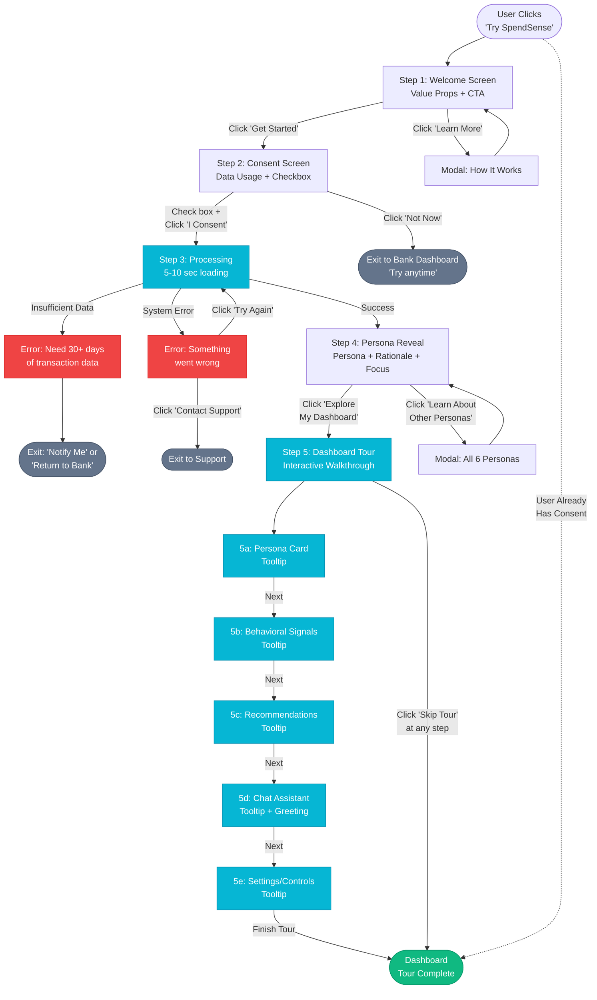

```mermaid
flowchart TD
    Start([User on Dashboard]) --> Cards[Step 1: Signal Cards<br/>4 cards visible]

    Cards -->|Click Credit<br/>Utilization Card| CreditDetail[Step 2: Credit Utilization<br/>Detail View]
    Cards -->|Click Subscription<br/>Card| SubDetail[Step 2: Subscription<br/>Detail View]
    Cards -->|Click Savings<br/>Card| SavingsDetail[Step 2: Savings<br/>Detail View]
    Cards -->|Click Income<br/>Card| IncomeDetail[Step 2: Income<br/>Detail View]

    CreditDetail --> DetailView[Shared Detail View Pattern:<br/>• Metrics<br/>• Trend Chart<br/>• Explanation<br/>• Related Recs]
    SubDetail --> DetailView
    SavingsDetail --> DetailView
    IncomeDetail --> DetailView

    DetailView -->|Toggle Time Window| TimeToggle{30-Day or<br/>180-Day?}
    TimeToggle -->|Switch View| DetailView

    DetailView -->|Click 'Ask Chat<br/>About This'| Chat[Step 3: Contextual Chat<br/>Pre-loaded with context]
    DetailView -->|Click 'View Related<br/>Recommendations'| RecsFilter[Step 4A: Recommendations<br/>Filtered by Signal]
    DetailView -->|Click Calculator<br/>Link| Tool[Step 4B: Interactive Tool<br/>Pre-populated with data]
    DetailView -->|Click Close/<br/>Back| Dashboard([Return to Dashboard])

    Chat -->|User Asks<br/>Questions| ChatConvo[Chat Conversation<br/>Data-driven answers]
    ChatConvo -->|Click Tool Link<br/>in Chat| Tool
    ChatConvo -->|Chat Suggests<br/>Recommendation| RecsFilter
    ChatConvo -->|End Conversation| Dashboard

    Tool -->|User Explores<br/>Calculator| ToolResults[Tool Shows Results<br/>Chat provides guidance]
    ToolResults -->|Done with Tool| Dashboard

    RecsFilter -->|View Recommendation<br/>Details| RecDetail[Recommendation Detail<br/>See Journey 3]
    RecsFilter -->|Close| Dashboard

    %% Error Paths
    DetailView -.->|No Data Available| Error1[Error: Insufficient Data<br/>'Check back later']
    DetailView -.->|Data Stale| Error2[Warning: Data Outdated<br/>'Refresh Now' CTA]
    Error1 --> Dashboard
    Error2 -->|Click Refresh| DetailView

    %% Styling
    classDef successState fill:#10b981,stroke:#059669,color:#fff
    classDef errorState fill:#f59e0b,stroke:#d97706,color:#fff
    classDef chatState fill:#06b6d4,stroke:#0891b2,color:#fff
    classDef detailState fill:#0891b2,stroke:#0e7490,color:#fff

    class Dashboard successState
    class Error1,Error2 errorState
    class Chat,ChatConvo chatState
    class DetailView,CreditDetail,SubDetail,SavingsDetail,IncomeDetail detailState
```

# SpendSense End-User Experience UX Design Specification

_Created on November 3, 2025 by Reena_
_Generated using BMad Method - Create UX Design Workflow v1.0_
_Status: **In Progress** - Phase 1-2 Complete (User Journeys Designed)_

---

## Executive Summary

This document defines the UX design for SpendSense's **end-user Dashboard + Chat interface** - the consumer-facing experience where users explore their financial behavioral signals, persona assignments, and personalized recommendations through an interactive dashboard guided by an AI chat coach.

**Project Vision:** Build the world's most transparent and ethical financial education AI system - one that empowers users through explainable recommendations while providing financial institutions with human oversight and auditability.

**Target Users:** End consumers receiving financial education (viewed through financial institution partnerships)

**Platform:** Responsive web/mobile application

**Emotional Goals:**
- **Primary:** Empowered and in control
- **Secondary:** Supported and guided

**Design Philosophy:** "I'm in the driver's seat, with a knowledgeable coach riding alongside me."

---

## 1. Design System Foundation

### 1.1 Design System Choice

**Selected: shadcn/ui v2.0**

**Rationale:**
- ✅ **Local-first compatible** - Components you own, no external runtime dependencies
- ✅ **Performance** - 2.3KB initial JS vs. 91KB (Material UI)
- ✅ **Full customization** - Edit components directly in codebase
- ✅ **Modern aesthetic** - Appeals to target users
- ✅ **WCAG AA accessibility** - Radix UI primitives built-in
- ✅ **Architecture alignment** - Explicitly specified in architecture.md line 20-24

**Technology Stack:**
- React 18+
- TypeScript
- TailwindCSS 3+
- Vite 5+
- shadcn/ui components (copy-paste model)

**Verification:** Confirmed compatible via Context7 and official shadcn/ui documentation. Supports React 18, TypeScript, Tailwind v3, and Vite with local-first development model.

---

## 2. Visual Foundation

### 2.1 Color System - "Balanced Calm" Theme

**Primary Color Palette:**

```
Primary: #0891b2 (Cyan-600)
  Use for: Primary actions, links, active states, focus rings
  Personality: Trust meets growth, calming professional

Primary Hover: #0e7490 (Cyan-700)
  Use for: Button hover states

Secondary: #64748b (Slate-500)
  Use for: Supporting content, metadata, secondary text

Accent: #06b6d4 (Cyan-500)
  Use for: Highlights, chat bubbles, interactive elements

Success: #10b981 (Emerald-500)
  Use for: Positive signals, improvements, achievements

Warning: #f59e0b (Amber-500)
  Use for: Needs attention, moderate concerns

Error: #ef4444 (Red-500)
  Use for: Critical issues, errors, overdue items

Background: #ecfeff (Cyan-50)
  Use for: Page background, subtle contrast

Surface: #ffffff (White)
  Use for: Cards, modals, input backgrounds

Text Primary: #0f172a (Slate-900)
  Use for: Headings, primary content

Text Muted: #64748b (Slate-500)
  Use for: Secondary text, captions, metadata

Border: #cffafe (Cyan-100)
  Use for: Dividers, card borders, input borders
```

**Color Psychology:**
- **Cyan/Teal blend** - Combines blue's trust with green's growth
- **Calming effect** - Reduces financial anxiety (matches PRD requirement)
- **Professional yet approachable** - Not too corporate, not too casual
- **Distinctive** - Stands out from traditional blue-only banks

**Theme Rationale:**
Chosen from 4 generated theme options. "Balanced Calm" harmonizes trust and growth, creates a supportive atmosphere, and aligns with the PRD's guidance for "calming colors (blues, greens) to convey stability and support."

### 2.2 Typography System

**Font Families:**
```
Sans: -apple-system, BlinkMacSystemFont, 'Segoe UI', Roboto, sans-serif
Mono: 'Monaco', 'Courier New', monospace (for data, hex codes)
```

**Type Scale:**
```
h1: 2.25rem (36px) / Bold (700) / Line-height 1.2
h2: 1.875rem (30px) / Semibold (600) / Line-height 1.3
h3: 1.5rem (24px) / Semibold (600) / Line-height 1.4
h4: 1.25rem (20px) / Medium (500) / Line-height 1.5
Body: 1rem (16px) / Regular (400) / Line-height 1.6
Small: 0.875rem (14px) / Regular (400) / Line-height 1.5
Tiny: 0.75rem (12px) / Regular (400) / Line-height 1.4
```

**Font Weights:**
```
Regular: 400 - Body text, descriptions
Medium: 500 - Labels, navigation
Semibold: 600 - Headings, emphasis
Bold: 700 - h1, critical alerts
```

### 2.3 Spacing System (8px base unit)

```
xs: 0.25rem (4px) - Tight spacing, icon gaps
sm: 0.5rem (8px) - Compact elements
md: 1rem (16px) - Default spacing
lg: 1.5rem (24px) - Section spacing
xl: 2rem (32px) - Major sections
2xl: 3rem (48px) - Page sections
3xl: 4rem (64px) - Hero spacing
```

### 2.4 Border Radius

```
sm: 4px - Inputs, tags
md: 6px - Buttons, small cards
lg: 8px - Cards, modals
xl: 12px - Feature cards, major elements
full: 9999px - Avatars, pills
```

### 2.5 Shadows (Depth Hierarchy)

```
sm: 0 1px 2px rgba(0,0,0,0.05) - Subtle elevation
md: 0 4px 6px rgba(0,0,0,0.07) - Cards, dropdowns
lg: 0 10px 15px rgba(0,0,0,0.1) - Modals, major elevation
xl: 0 20px 25px rgba(0,0,0,0.15) - Overlays, dialogs
```

---

## 3. Design Direction Decisions

### 3.1 Responsive Design Strategy

**Context-Adaptive Approach:**
Different layouts optimized for different screen sizes and use cases.

### 3.2 Desktop/Web Experience

**Primary: Direction 2 - Split-Screen Companion**

**Layout:**
- 60/40 split (dashboard left, persistent chat right)
- Dashboard shows all behavioral signals and recommendations
- Chat always visible on right side
- Chat context updates based on what user views on left

**Characteristics:**
- Layout: 60/40 split-screen
- Chat Integration: Persistent sidebar
- Density: Balanced
- Navigation: In-dashboard scroll

**Best For:** Desktop users wanting continuous guidance

**Emotional Impact:** Maximizes "empowered + supported" feeling - user controls exploration (left) while coach provides context (right)

**Technical Notes:**
- Minimum viewport width: 1024px
- Chat sidebar collapses to floating widget on tablets (768px-1023px)

---

**Alternative: Direction 4 - Card Gallery with Inline Chat**

**Layout:**
- Vertical card feed (persona, signals, recommendations)
- Chat messages appear inline between cards
- Natural contextual flow from data → explanation → action
- Each card can expand for details

**Characteristics:**
- Layout: Vertical card feed
- Chat Integration: Inline contextual
- Density: Spacious
- Navigation: Scroll-based

**Best For:** Quick scanners, bridges web and mobile

**Responsive Foundation:** Scales naturally from desktop to mobile

---

### 3.3 Mobile Experience

**Primary: Direction 4 - Card Gallery with Inline Chat**

**Layout:**
- Mobile-optimized vertical card feed
- Chat messages inline within feed
- Scannable at-a-glance
- Single-column, thumb-friendly

**Characteristics:**
- Layout: Single-column feed
- Chat Integration: Inline
- Density: Mobile-optimized spacing
- Scroll: Natural vertical scroll

**Best For:** Mobile-first users, quick scanning

---

**Navigation: Direction 6 - Bottom Tab Navigation**

**Layout:**
- Bottom navigation bar with 5 tabs:
  1. 📊 Dashboard - Overview and key metrics
  2. 📈 Signals - Deep dive into behavioral data
  3. 💬 Chat - Dedicated chat interface
  4. 💡 Tips - Recommendations feed
  5. ⚙️ More - Settings and profile

**Characteristics:**
- Layout: Bottom tab navigation
- Chat Integration: Dedicated tab
- Density: Mobile-optimized
- Navigation: App-style tabs

**Best For:** Mobile-first users expecting app-style navigation

**Technical Notes:**
- Fixed bottom nav (doesn't scroll away)
- Active tab indicator (color + icon fill)
- Thumb zone optimized (48px minimum touch targets)

---

## 4. Chat Implementation Strategy

### 4.1 Technical Architecture (Based on Proven Patterns)

**Data Structure - Normalized Store:**
```typescript
interface ChatState {
  ids: string[];              // Message IDs in chronological order
  entities: {                 // Message details indexed by ID
    [id: string]: {
      id: string;
      content: string;
      timestamp: number;
      sender: 'user' | 'assistant';
      type: 'text' | 'card' | 'action';
      metadata?: {
        relatedSignal?: string;  // Links message to behavioral signal
        actionable?: boolean;     // Can user take action?
      }
    }
  }
}
```

**Rationale:** Normalized data prevents redundant renders, enables efficient updates, and supports memoized selectors.

### 4.2 Rendering Strategy

**Inverted List Pattern:**
- Newest messages render at bottom (natural chat UX)
- Virtualization for performance with long histories
- Memoized message components (React.memo)
- Batched updates for multi-message insertions

**Performance Optimizations:**
- Initial render: Last 20 messages
- Load more on scroll (infinite scroll upward)
- Window size optimization for virtualization
- Cached message heights prevent scroll jumps

**Scroll Stability:**
- `maintainVisibleContentPosition` prevents jumps when new messages arrive
- Smart scroll-to-bottom when user sends message
- Maintain scroll position when loading historical messages

### 4.3 SpendSense-Specific Chat Features

**Contextual Intelligence:**
- Chat knows what dashboard card/signal user is viewing
- Proactive help offers: "Want me to explain this signal?"
- Quick actions embedded: "Show me strategies"

**Financial Data Integration:**
- Render financial data cards inline within chat
- Interactive charts/calculators in chat flow
- "Because" rationales cite specific data with clickable links to source

**Conversation Patterns:**
1. **Onboarding:** Explain persona assignment and what it means
2. **Exploratory:** Answer questions like "Why is my credit utilization high?"
3. **Action-oriented:** Provide guidance "How do I improve this?"
4. **Supportive:** Celebrate improvements "Great job reducing utilization!"

**Tone Guardrails (Enforced):**
- Non-judgmental language always
- Empowering framing ("opportunity to optimize" vs. "you're doing it wrong")
- Plain language (grade-8 readability)
- Supportive tone validation from backend

### 4.4 Accessibility

- **Screen reader support:** Announce new messages
- **Keyboard navigation:** Full keyboard access to chat
- **Respect `reduceMotion`:** No animations if user prefers reduced motion
- **Focus management:** Maintain focus for newly added messages
- **WCAG AA compliance:** Color contrast, touch targets, form labels

---

## 5. UX Patterns Learned from Inspiration Apps

### 5.1 From YNAB (Empowerment through Control)
- ✅ Consistent UI patterns across all features
- ✅ Persistent help/chat always accessible (bottom-right)
- ✅ Semantic color system (green=good, yellow=warning, red=action)
- ✅ Walkthroughs for onboarding

**SpendSense Application:** Consistent shadcn/ui components, always-accessible chat coach

### 5.2 From Mint (Clarity through Visualization)
- ✅ Color-coded status indicators (instant understanding)
- ✅ Smart auto-categorization with learning
- ✅ 3-step max accessibility (any feature within 3 clicks)
- ✅ Search everywhere functionality

**SpendSense Application:** Visual status indicators for signals, powerful search

### 5.3 From Credit Karma (Motivation through Wins)
- ✅ Celebrate milestones (nudges for improvements)
- ✅ Cash flow insights with comparisons
- ⚠️ Avoid: Too many similar features (confusing)

**SpendSense Application:** Celebrate behavioral improvements, focused feature set

### 5.4 From Origin (Understanding through Conversation)
- ✅ Plain-language AI (conversational, not jargon)
- ✅ Seamless navigation integration (chat accessible anywhere)
- ✅ Light/dark mode support
- ✅ Real-time contextual memory

**SpendSense Application:** Conversational chat with context memory, plain-language explanations

### 5.5 From Zogo (Engagement through Gamification)
- ✅ Bite-sized learning (short modules)
- ✅ Self-directed exploration (user chooses path)
- ✅ Progress tracking (visual level-up)
- ✅ Daily engagement (Money Minute digest)

**SpendSense Application:** Educational content in digestible chunks, user-driven exploration

---

## 6. Core Experience Principles

Based on "Empowered + Supported" emotional goals:

### 6.1 Dashboard as Control Center
- Clear status indicators (persona, signals, recommendations)
- Exploration-friendly (click any signal for deep dive)
- 3-step max to any feature
- User controls pace and depth of exploration

### 6.2 Chat as Supportive Guide
- Always accessible (persistent or easy toggle)
- Conversational, plain-language explanations
- Contextual memory (remembers exploration context)
- Proactive help offers ("Want to understand this signal?")
- Never intrusive, always helpful

### 6.3 Visual Clarity
- Semantic colors for status (within budget, needs attention, action required)
- Consistent UI patterns throughout (shadcn/ui components)
- Light/dark mode support (future enhancement)
- Progressive disclosure (show essentials, expand for details)

### 6.4 Celebrate Progress
- Milestone recognition (credit utilization improved, savings increased)
- Non-judgmental tone always
- Focus on opportunity, not shame
- Positive reinforcement for behavioral improvements

### 6.5 Educational Depth
- Bite-sized content in recommendations
- Self-directed learning paths
- Deep dives available when users want them
- "Because" rationales citing specific data

---

## 7. Deliverables Created

### 7.1 Interactive Visualizations

**Color Theme Explorer:**
- File: `docs/ux-color-themes.html`
- Content: 4 complete color theme options with live UI examples
- Selected: Theme 3 - Balanced Calm (#0891b2 primary)

**Design Direction Mockups:**
- File: `docs/ux-design-directions.html`
- Content: 8 complete design approaches for Dashboard + Chat
- Navigation: Previous/Next buttons, keyboard arrows
- Selections:
  - Web: Direction 2 (Split-Screen), Direction 4 (Card Gallery)
  - Mobile: Direction 4 (Card Gallery), Direction 6 (Bottom Nav)

### 7.2 Documentation

**This Document:**
- File: `docs/ux-design-specification.md`
- Status: In Progress - Phase 1-2 Complete
- Sections Completed: 1-8 (Design System through User Journeys)
- Sections Remaining: Component Library, UX Patterns, Responsive/Accessibility Strategy

---

## 8. User Journey Designs

This section documents the four core user journeys for the SpendSense end-user Dashboard + Chat interface. Each journey includes step-by-step flows, decision points, error handling, and visual Mermaid diagrams.

---

### 8.1 Journey 1: Onboarding Journey

**Flow:** Consent → Persona Reveal → Dashboard Tour

**Context:** First-time user accessing SpendSense through their financial institution's platform.

**Entry Point:** User clicks "Try SpendSense" link from their bank's dashboard or receives invitation email.

**Goals:**
- Obtain explicit consent for data processing
- Explain what SpendSense does and how it works
- Reveal assigned persona with clear rationale
- Orient user to dashboard features
- Set expectations (education, not financial advice)

#### Step-by-Step Flow

**Step 1: Welcome & Introduction**
- **Screen:** Welcome screen with SpendSense branding
- **Content:**
  - Headline: "Welcome to SpendSense"
  - Subheading: "Understand your financial behavior and get personalized education"
  - Key value props (3 bullets):
    - 📊 Discover your financial behavioral patterns
    - 💡 Receive personalized educational recommendations
    - 🔒 Your data, your control – fully transparent
  - CTA Button: "Get Started" (primary cyan)
  - Link: "Learn more about how it works"
- **Actions:**
  - Click "Get Started" → Step 2 (Consent Screen)
  - Click "Learn more" → Opens modal with detailed explanation (dismissable)
- **Platform Differences:** None – same on web and mobile

**Step 2: Consent & Data Usage Explanation**
- **Screen:** Consent screen (full-screen modal or dedicated page)
- **Content:**
  - Headline: "Before we begin, here's what happens next"
  - **Transparent Data Usage Explanation:**
    - "We'll analyze your transaction data from the last 180 days"
    - "We'll look for patterns like subscription spending, credit utilization, and savings habits"
    - "Based on these patterns, we'll assign you to a financial behavior persona"
    - "You'll receive 3-5 personalized educational resources (no product sales)"
  - **What We DON'T Do:**
    - ❌ Share your data with third parties without consent
    - ❌ Provide regulated financial advice
    - ❌ Judge or shame your financial choices
  - **Your Controls:**
    - ✅ Revoke consent anytime from settings
    - ✅ See exactly what data drives each recommendation
    - ✅ Choose what to explore and when
  - **Consent Checkbox:** "I consent to SpendSense analyzing my transaction data to provide personalized financial education" (unchecked by default)
  - **Disclaimer:** Small text below checkbox: "This is educational content, not financial advice. Consult a licensed advisor for personalized guidance."
  - **CTA Buttons:**
    - Primary: "I Consent & Continue" (disabled until checkbox checked)
    - Secondary: "Not Now" (grey)

- **Decision Point:**
  - ✅ **User checks box + clicks "I Consent"** → Step 3 (Processing & Persona Assignment)
  - ❌ **User clicks "Not Now"** → Exit flow, return to bank dashboard with message: "You can try SpendSense anytime from your dashboard"

- **Edge Cases:**
  - User closes browser mid-consent → No data saved, must restart from Step 1 on return
  - User already consented previously → Skip Steps 1-2, go directly to Dashboard (returning user flow)

- **Platform Differences:**
  - Mobile: Scrollable screen with sticky CTA buttons at bottom
  - Web: Single-screen modal with all content visible

**Step 3: Processing & Persona Assignment**
- **Screen:** Loading screen with progress indicator
- **Content:**
  - **Progress Animation:** Animated spinner or progress bar (cyan accent color)
  - **Status Messages (rotate every 2-3 seconds):**
    - "Analyzing your transaction patterns..."
    - "Detecting behavioral signals..."
    - "Identifying your financial persona..."
    - "Generating personalized recommendations..."
  - **Expected Duration:** 5-10 seconds

- **Technical Context:**
  - Backend processes: Behavioral signal detection → Persona matching → Recommendation generation
  - All guardrails applied (consent verified, tone validation, eligibility filtering)

- **Error Handling:**
  - **Insufficient Data Error:** "We need at least 30 days of transaction history to generate insights. Check back soon!"
    - Recovery: "Return to Dashboard" button → Exit to bank platform
  - **System Error:** "Something went wrong on our end. We're looking into it."
    - Recovery: "Try Again" button → Restart from Step 3
    - Fallback: "Contact Support" link

- **Success Transition:** Auto-advance to Step 4 when processing complete

**Step 4: Persona Reveal**
- **Screen:** Persona reveal screen (celebratory, empowering tone)
- **Content:**
  - **Visual:** Large persona icon/illustration (custom for each persona)
  - **Headline:** "Your Financial Persona: [Persona Name]"
  - **Subheading (Persona Description):**
    - Example for "High Utilization Manager": "You're actively using credit and could benefit from strategies to optimize utilization and reduce interest costs."
    - Example for "Savings Builder": "You're building financial cushions and could benefit from strategies to accelerate emergency fund growth."
  - **Why This Persona Section:**
    - "Based on your transaction patterns, we noticed:"
    - Bullet list of 2-3 specific signals (transparent rationale):
      - "Your Visa ending in 4523 is at 68% utilization ($3,400 of $5,000 limit)"
      - "You have 7 active subscriptions totaling $124/month"
    - "These patterns suggest you'd benefit most from [persona focus area] education"
  - **What This Means Section:**
    - "You'll receive personalized recommendations for:"
    - 3 bullet points listing educational focus areas for this persona
      - Example: "Credit utilization optimization strategies"
      - Example: "Subscription audit and cost reduction tools"
      - Example: "Debt paydown calculators"
  - **CTA Button:** "Explore My Dashboard" (primary cyan)
  - **Secondary Link:** "Learn about other personas" (opens modal with all 6 personas)

- **Decision Point:**
  - Click "Explore My Dashboard" → Step 5 (Dashboard Tour)
  - Click "Learn about other personas" → Modal opens, user can read and dismiss, stays on Step 4

- **Emotional Design:** Empowered + Supported
  - Non-judgmental language ("optimize" not "fix")
  - Specific data citations (builds trust)
  - Opportunity-focused framing

- **Platform Differences:** None – same layout on web and mobile (mobile scrolls if needed)

**Step 5: Dashboard Tour (Interactive Walkthrough)**
- **Screen:** Dashboard with overlay tooltips/spotlight (progressive disclosure)
- **Tour Steps (5 key areas):**

  **5a. Overview Section**
  - **Tooltip Position:** Points to persona card at top
  - **Content:** "This is your assigned persona. You can always see why you received it by clicking 'View Details'"
  - **Action:** Click "Next" → Step 5b

  **5b. Behavioral Signals Section**
  - **Tooltip Position:** Points to signals section (credit, subscriptions, savings, income cards)
  - **Content:** "These cards show the behavioral patterns we detected. Click any signal to see detailed breakdowns and trends."
  - **Action:** Click "Next" → Step 5c

  **5c. Recommendations Section**
  - **Tooltip Position:** Points to recommendations feed
  - **Content:** "Your personalized educational resources. Each recommendation explains exactly why we're showing it to you based on your specific data."
  - **Action:** Click "Next" → Step 5d

  **5d. Chat Assistant**
  - **Tooltip Position:** Points to chat sidebar (web) or chat tab (mobile)
  - **Content:** "Ask me anything about your financial patterns or recommendations. I'm here to help you understand and learn."
  - **Proactive Chat Message:** Chat sends: "Hi! I'm your SpendSense coach. Want me to explain your persona assignment?"
  - **Action:** Click "Next" → Step 5e

  **5e. Settings & Controls**
  - **Tooltip Position:** Points to settings icon/menu
  - **Content:** "You're in control. Revoke consent, adjust privacy settings, or toggle between 30-day and 180-day views anytime."
  - **Action:** Click "Finish Tour" → Dashboard (tour complete)

- **Tour Controls:**
  - "Next" and "Back" buttons on each tooltip
  - "Skip Tour" link (dismisses tour, stays on dashboard)
  - Progress indicator: "Step 1 of 5", "Step 2 of 5", etc.

- **Completion State:**
  - Tour dismissed
  - User lands on fully functional dashboard
  - Chat remains open with proactive greeting message
  - Tour can be restarted from Help menu ("Restart Tour")

- **Platform Differences:**
  - **Web:** Overlay tooltips with spotlight effect (dimmed background)
  - **Mobile:** Bottom sheet tooltips with arrows pointing to UI elements

#### Error Handling & Edge Cases

1. **User Already Has Consent (Returning User)**
   - Skip Steps 1-4 entirely
   - Load directly into Dashboard
   - Show subtle notification: "Welcome back! [Persona Name]"

2. **Insufficient Transaction History**
   - After Step 3 processing, show error: "We need at least 30 days of transaction data. Check back soon!"
   - CTA: "Notify Me When Ready" (email opt-in) or "Return to [Bank Name]"

3. **No Persona Match (Edge Case)**
   - Assign to "Young Professional" (lowest priority, default fallback)
   - Explanation: "We're still learning about your patterns. As we gather more data, we'll refine your persona."

4. **System Error During Processing**
   - Friendly error: "Something went wrong on our end."
   - CTA: "Try Again" or "Contact Support"
   - Log error for operator review

5. **User Revokes Consent Mid-Onboarding**
   - Immediately halt processing
   - Clear any partial data
   - Return to bank dashboard with confirmation: "Consent revoked. No data was saved."

6. **User Abandons Flow (Closes Browser)**
   - No data saved until consent granted
   - On return, restart from Step 1

#### Success Metrics

- **Consent Rate:** % of users who complete Step 2 consent
- **Completion Rate:** % of users who complete full onboarding (reach dashboard)
- **Tour Completion:** % of users who finish all 5 tour steps vs. skip
- **Time to Dashboard:** Average duration from Step 1 → Step 5 completion
- **Error Rate:** % of users encountering errors in Step 3

#### Journey Diagram



---

### 8.2 Journey 2: Signal Exploration Journey

**Flow:** Click Signal → View Details → Ask Chat

**Context:** User is on the dashboard and wants to understand a specific behavioral signal in depth.

**Entry Point:** User clicks on any signal card (Credit Utilization, Subscriptions, Savings, or Income Stability).

**Goals:**
- Provide detailed breakdown of the specific behavioral pattern
- Show trend data (30-day vs 180-day comparison)
- Enable natural transition to chat for questions
- Maintain transparency (show all underlying data)

#### Step-by-Step Flow

**Step 1: Signal Card Selection**
- **Screen:** Dashboard (overview state)
- **Signal Cards Available (4 types):**
  1. **Credit Utilization Card**
     - Summary: "68% utilization on Visa ****4523"
     - Visual indicator: Progress bar (color-coded: green <30%, yellow 30-60%, red >60%)
     - Status badge: "Needs Attention" (amber) or "Good" (green) or "Action Required" (red)

  2. **Subscription Spending Card**
     - Summary: "7 active subscriptions • $124/month"
     - Visual: Icon grid showing subscription logos
     - Status badge: Based on % of income

  3. **Savings Pattern Card**
     - Summary: "2.5 months emergency fund saved"
     - Visual: Progress toward 6-month goal
     - Status badge: "Building" (cyan) or "Strong" (green)

  4. **Income Stability Card**
     - Summary: "Consistent income • Biweekly deposits"
     - Visual: Mini trend line
     - Status badge: "Stable" (green) or "Variable" (yellow)

- **Interaction:**
  - Hover (web): Card slightly elevates, cursor changes to pointer
  - Click/Tap: Expands to detailed view (Step 2)

- **Platform Differences:**
  - **Web:** 2×2 grid layout, cards side-by-side
  - **Mobile:** Vertical stack, swipeable carousel

**Step 2: Signal Detail View (Expanded State)**

**Layout:** Full-screen modal (web) or dedicated page (mobile)

**Structure (All Signal Types Follow This Pattern):**

##### Header Section:
- **Back Navigation:** "← Back to Dashboard" or "✕ Close"
- **Signal Title:** Large heading (e.g., "Credit Utilization Details")
- **Current Status:** Prominent display with visual indicator
  - Example: "68% Utilization" with color-coded progress bar
- **Time Window Toggle:** Pills for "30-Day View" and "180-Day View" (active state highlighted)

##### Key Metrics Section:
**For Credit Utilization:**
- **Current Balance:** "$3,400"
- **Credit Limit:** "$5,000"
- **Utilization Rate:** "68%" (large, color-coded)
- **Comparison:** "↑ 12% vs. last month" (trend indicator)
- **Affected Accounts:**
  - Card list showing:
    - "Visa ****4523: $3,400 / $5,000 (68%)" [Red]
    - "Mastercard ****8901: $450 / $2,000 (23%)" [Green]

**For Subscriptions:**
- **Active Subscriptions:** "7"
- **Monthly Cost:** "$124"
- **% of Monthly Income:** "3.2%"
- **Comparison:** "→ Same as last month"
- **Subscription Breakdown:**
  - List with logos:
    - "Netflix • $15.99/month"
    - "Spotify • $9.99/month"
    - "Adobe Creative Cloud • $54.99/month"
    - etc.

**For Savings:**
- **Current Savings:** "$12,500"
- **Monthly Income:** "$5,000"
- **Months Covered:** "2.5 months"
- **Goal:** "6 months emergency fund"
- **Progress:** Progress bar showing 42% toward goal
- **Comparison:** "↑ $800 vs. last month"

**For Income:**
- **Average Monthly Income:** "$5,000"
- **Income Pattern:** "Biweekly deposits"
- **Stability Score:** "Stable" (green badge)
- **Recent Deposits:**
  - "Nov 1: $2,500 (Employer Direct Deposit)"
  - "Oct 18: $2,500 (Employer Direct Deposit)"
  - "Oct 4: $2,500 (Employer Direct Deposit)"

##### Trend Visualization Section:
- **Chart:** Line graph or bar chart showing signal over time
  - X-axis: Time (daily for 30-day, weekly for 180-day)
  - Y-axis: Signal metric (%, $, count)
  - Color-coded zones (green/yellow/red thresholds)
- **Toggle:** Switch between 30-day and 180-day view updates the chart

##### What This Means Section:
- **Plain-Language Explanation:**
  - "Your credit utilization is above the recommended 30% threshold. High utilization can impact your credit score and increase interest charges."
  - Written at grade-8 readability
  - Non-judgmental, educational tone

##### Related Recommendations Section:
- **Callout Box:** "Based on this pattern, we recommend:"
- **Linked Recommendations (2-3 items):**
  - Example: "📄 Credit Utilization Guide: How to Lower Your Balance" [Link to recommendation detail]
  - Example: "🧮 Debt Paydown Calculator: See Your Payoff Timeline" [Link to tool]
- **Chat Prompt Button:** "Ask Chat: Why does this matter?" (cyan accent)

##### Action Buttons (Bottom of Modal/Page):
- **Primary CTA:** "Ask Chat About This" (cyan button)
- **Secondary:** "View Related Recommendations" (ghost button)
- **Tertiary:** "Close" or "Back to Dashboard" (text link)

**Step 3: Contextual Chat Interaction**

**Trigger:** User clicks "Ask Chat About This" or "Ask Chat: Why does this matter?"

**Platform-Specific Behavior:**

**Web (Split-Screen Layout):**
- Signal detail view stays open on left (60% width)
- Chat sidebar opens on right (40% width) if not already open
- Chat auto-scrolls to bottom and pre-populates with contextual greeting

**Mobile (Bottom Sheet or Tab Navigation):**
- Signal detail view minimizes/closes
- Chat tab becomes active
- User navigates to Chat tab, which is pre-loaded with context

**Chat Contextual Greeting:**
The chat assistant knows what signal the user was viewing and sends a proactive message:

**Example for Credit Utilization:**
```
Chat: "I see you're looking at your credit utilization. You're currently at 68% on your Visa ****4523. Would you like to understand why this matters or explore strategies to bring it down?"

[Quick Reply Buttons]:
- "Why does 68% matter?"
- "How can I lower it?"
- "Will this affect my credit score?"
```

**Example for Subscriptions:**
```
Chat: "You have 7 active subscriptions totaling $124/month. That's about 3% of your income. Would you like help auditing these or finding opportunities to save?"

[Quick Reply Buttons]:
- "Are these subscriptions too many?"
- "Which ones should I review?"
- "Show me savings opportunities"
```

**Step 4: Deep Dive Actions (Optional Paths)**

**Path A: View Related Recommendations**
- User clicks "View Related Recommendations"
- Transitions to Recommendations section of dashboard
- Filters recommendations related to this signal
- Chat remains available with context

**Path B: Use Calculator/Tool**
- User clicks calculator link in chat or recommendation
- Opens interactive tool (e.g., Debt Paydown Calculator)
- Tool pre-populated with user's data
- Chat provides guidance: "I've filled in your current balance. Try adjusting the monthly payment to see different timelines."

**Path C: Explore Time Window Comparison**
- User toggles between 30-day and 180-day views
- Chart updates, comparison metrics recalculate
- If significant difference, chat proactively offers insight:
  ```
  Chat: "I noticed your utilization increased 12% in the last 30 days compared to your 180-day average. Want to explore what changed?"
  ```

**Path D: Return to Dashboard**
- User clicks "Back to Dashboard" or "✕ Close"
- Signal detail view closes
- Dashboard overview returns
- Chat history preserved (can continue conversation later)

#### Decision Points

1. **Which Signal to Explore?**
   - User chooses any of 4 signal cards
   - Each signal has unique detail structure but follows same UX pattern

2. **Which Time Window?**
   - 30-day (recent behavior, more actionable)
   - 180-day (long-term trends, broader context)
   - User can toggle anytime

3. **How Deep to Go?**
   - Stay at summary level (Step 2 only)
   - Ask chat for explanations (Step 3)
   - Use tools/calculators (Step 4 Path B)
   - View recommendations (Step 4 Path A)

4. **When to Leave?**
   - User controls exit at any step
   - Can return to dashboard anytime
   - Chat context preserved for continuity

#### Error Handling & Edge Cases

1. **No Data for Signal**
   - Display: "We don't have enough data for this signal yet. Check back after more transactions are processed."
   - CTA: "Return to Dashboard"

2. **Stale Data (Last Updated > 7 Days)**
   - Show warning: "⚠️ Data last updated on [Date]. Refresh for latest insights."
   - CTA: "Refresh Now" → Re-runs signal detection

3. **Time Window Insufficient (e.g., User < 180 Days History)**
   - Disable 180-day toggle
   - Show tooltip: "Not enough history for 180-day view"
   - Only show 30-day data

4. **Chart Rendering Error**
   - Fallback: Show table of values instead of chart
   - Error message: "Chart unavailable. View data table below."

5. **Chat Unavailable**
   - Disable "Ask Chat" buttons
   - Show message: "Chat temporarily unavailable. Try again in a moment."
   - User can still view signal details

#### Success Metrics

- **Signal Engagement Rate:** % of users who click into signal details from dashboard
- **Most Explored Signals:** Which signals get clicked most (guides content prioritization)
- **Time Window Usage:** % using 30-day vs 180-day views
- **Chat Transition Rate:** % of users who move from signal detail → chat
- **Tool Usage:** % who use calculators/tools from signal exploration
- **Recommendation Click-Through:** % who click related recommendations

#### Journey Diagram



---

### 8.3 Journey 3: Recommendation Flow

**Flow:** View Recommendation → Understand Rationale → Take Action

**Full Documentation:** See [ux-journey-3-recommendation-flow.md](./ux-journey-3-recommendation-flow.md)

**Summary:**
- **Entry:** Recommendations section on dashboard or "View Related Recommendations" from signal exploration
- **Key Steps:** Feed overview → Detail view with transparent rationale → Take action (read/download/explore) → Provide feedback
- **Features:** Educational content (articles, tools, templates) and partner offers with eligibility checks, external link warnings, data-driven savings calculations
- **Metrics:** View rates, action completion, click-through rates, feedback quality

### 8.4 Journey 4: Chat Interaction Patterns

**Flow:** Ask Question → Receive Explanation → Follow-up Questions

**Full Documentation:** See [ux-journey-4-chat-interaction.md](./ux-journey-4-chat-interaction.md)

**Summary:**
- **Entry Points:** Proactive greeting (onboarding), "Ask Chat" buttons (signal/recommendation views), direct chat access
- **Key Features:** Context-aware responses, quick reply buttons, data citations, 5 conversation patterns (persona/signal/recommendation/how-to/comparison)
- **Guardrails:** No financial advice, tone validation, inappropriate content filtering
- **Metrics:** Engagement rate, conversation length, resolution rate, guardrail trigger rate

---

### 8.5 Next Steps (Remaining UX Design Tasks)

**Priority 2: Component Library Definition**
- List all shadcn/ui components needed (from design directions and journeys)
- Define custom components (financial data cards, signal visualizations, chat interface)
- Document component states (default, hover, active, loading, error)
- Specify component variants and when to use each

**Priority 3: UX Pattern Decisions**
- Button hierarchy (primary, secondary, tertiary, destructive)
- Feedback patterns (success, error, warning, loading states)
- Form patterns (labels, validation, help text)
- Modal patterns (sizes, dismiss behavior, focus)
- Navigation patterns (active states, breadcrumbs if needed)
- Empty state patterns (first use, no results, cleared content)
- Confirmation patterns (delete, leave unsaved, irreversible actions)

**Priority 4: Responsive & Accessibility Strategy**
- Define breakpoints precisely (mobile: <768px, tablet: 768-1023px, desktop: 1024px+)
- Document how Split-Screen (Direction 2) adapts to tablet
- Document how Card Gallery (Direction 4) scales across all sizes
- Specify touch target sizes for mobile (minimum 48x48px)
- Define keyboard navigation requirements
- Document screen reader behavior for all interactive elements
- Confirm WCAG AA compliance checklist

**Priority 5: Finalize Specification**
- Create developer handoff materials
- Generate final HTML mockups (optional)
- Update workflow status file

---

## 9. Technical Integration Notes

### 9.1 Architecture Alignment

This UX specification aligns with:
- **Architecture Document:** `docs/architecture.md`
- **PRD:** `docs/prd.md`
- **Technology Stack:** React 18 + TypeScript + TailwindCSS + Vite + shadcn/ui (confirmed lines 20-24, 204-209 of architecture.md)

### 9.2 Implementation Readiness

**Frontend Stack (Ready):**
- ✅ React 18+ (specified)
- ✅ TypeScript (specified)
- ✅ TailwindCSS 3+ (specified)
- ✅ Vite 5+ (specified)
- ✅ shadcn/ui components (specified, compatible verified)

**Backend Integration Points:**
- GET `/profile/{user_id}` - Fetch persona and behavioral signals
- GET `/recommendations/{user_id}` - Fetch personalized recommendations
- POST `/chat/message` - Send user message, receive AI response
- GET `/chat/history/{user_id}` - Fetch chat history

**Data Requirements:**
- Behavioral signals (credit utilization, subscriptions, savings, income)
- Persona assignment with decision trace
- Recommendations with rationales
- Chat message history

### 9.3 Design Tokens for Implementation

**Tailwind Config Extensions:**
```javascript
// tailwind.config.js
module.exports = {
  theme: {
    extend: {
      colors: {
        primary: {
          DEFAULT: '#0891b2',
          hover: '#0e7490',
        },
        accent: '#06b6d4',
        // ... rest of color palette
      },
      spacing: {
        // 8px base unit already in Tailwind
      },
      borderRadius: {
        // Already covered by Tailwind defaults
      },
      boxShadow: {
        'sm': '0 1px 2px rgba(0,0,0,0.05)',
        'md': '0 4px 6px rgba(0,0,0,0.07)',
        'lg': '0 10px 15px rgba(0,0,0,0.1)',
        'xl': '0 20px 25px rgba(0,0,0,0.15)',
      }
    }
  }
}
```

---

## 10. References

### 10.1 Source Documents
- **PRD:** `/Users/reena/gauntletai/spendsense/docs/prd.md`
- **Architecture:** `/Users/reena/gauntletai/spendsense/docs/architecture.md`
- **User Interface Design Goals:** `/Users/reena/gauntletai/spendsense/docs/prd/user-interface-design-goals.md`

### 10.2 Generated Assets
- **Color Theme Visualizer:** `/Users/reena/gauntletai/spendsense/docs/ux-color-themes.html`
- **Design Direction Mockups:** `/Users/reena/gauntletai/spendsense/docs/ux-design-directions.html`
- **This Specification:** `/Users/reena/gauntletai/spendsense/docs/ux-design-specification.md`

### 10.3 External References
- **shadcn/ui Documentation:** https://ui.shadcn.com/docs
- **shadcn/ui Vite Installation:** https://ui.shadcn.com/docs/installation/vite
- **Chat Implementation Patterns:** https://github.com/reena96/messageAi/blob/main/docs/ux/flatlist-inverted-normalized-data.md
- **WCAG 2.1 AA Guidelines:** https://www.w3.org/WAI/WCAG21/quickref/?currentsidebar=%23col_customize&levels=aa

### 10.4 Inspiration Apps Analyzed
- **YNAB:** Budgeting, consistent UI patterns, persistent help
- **Mint:** Transaction categorization, color-coded status, visual clarity
- **Credit Karma:** Credit insights, milestone celebrations, recommendations
- **Origin Financial:** AI financial advisor, conversational interface, plain language
- **Zogo:** Gamified financial literacy, bite-sized learning, engagement

---

## 11. Version History

| Date | Version | Changes | Author |
|------|---------|---------|--------|
| 2025-11-03 | 0.5 | Phase 1 Complete: Design system, visual foundation, design directions selected | Reena |
| 2025-11-03 | 0.75 | Phase 2 User Journeys Complete: Onboarding, signal exploration, recommendation flow, chat interaction patterns with Mermaid diagrams | Reena |
| TBD | 1.0 | Phase 3: Component library, UX patterns, responsive/accessibility strategy, developer handoff | TBD |

---

## Appendix A: Decision Log

### A.1 Design System Selection

**Options Considered:**
1. shadcn/ui (copy-paste components, Tailwind-based)
2. Material UI (comprehensive, enterprise-proven)
3. Chakra UI (developer-friendly, accessible)
4. Carbon Design System (IBM, data-visualization focus)

**Decision:** shadcn/ui

**Rationale:**
- Local-first requirement (no npm bloat, components you own)
- Performance (2.3KB vs. 91KB for MUI)
- Already specified in architecture document (line 24)
- Customization freedom for "supportive education" tone
- Compatible with React 18 + TypeScript + Tailwind + Vite stack

**Verification:** Context7 + official docs confirmed compatibility

### A.2 Color Theme Selection

**Options Generated:** 4 themes
1. Trust Blue (#2563eb) - Professional, stable
2. Growth Green (#059669) - Optimistic, educational
3. Balanced Calm (#0891b2) - **SELECTED** - Harmonious, supportive
4. Modern Fintech (#7c3aed) - Innovative, distinctive

**Decision:** Theme 3 - Balanced Calm

**Rationale:**
- Combines blue's trust with green's growth (cyan/teal)
- Calming effect reduces financial anxiety (PRD requirement)
- Professional yet approachable
- Distinctive from traditional banks
- User preference confirmed

### A.3 Design Direction Selection

**Options Generated:** 8 design directions

**Desktop Decision:** Split-Screen Companion (#2) + Card Gallery (#4)

**Rationale:**
- Split-Screen maximizes "empowered + supported" goal
- Persistent chat = constant guidance
- Card Gallery bridges web/mobile responsively

**Mobile Decision:** Card Gallery (#4) + Bottom Nav (#6)

**Rationale:**
- Card Gallery naturally mobile-optimized
- Bottom Nav = familiar app-style navigation
- Thumb-friendly, scannable
- User preference for mobile-first experience

---

**END OF PHASE 1 SPECIFICATION**

_To resume: Reference this document and continue with Section 8.1 Priority 1 (User Journey Design)_
