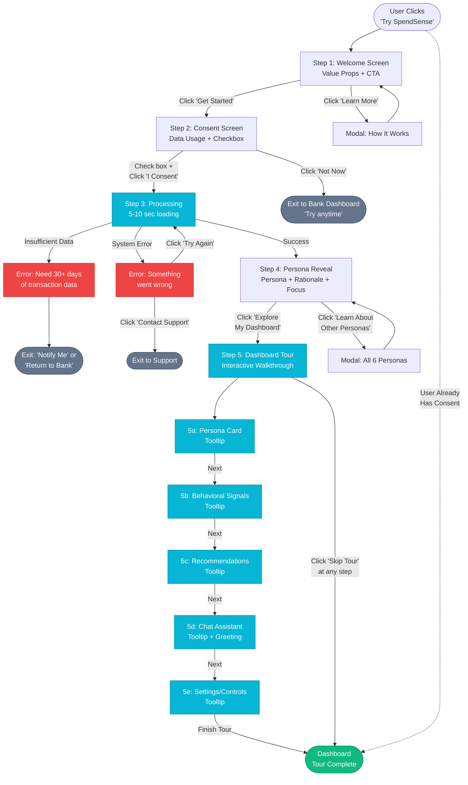

# User Journey 1: Onboarding Journey

**SpendSense End-User Experience**
**Flow:** Consent → Persona Reveal → Dashboard Tour
**Version:** 1.0
**Last Updated:** November 3, 2025

---

## Overview

### Context
First-time user accessing SpendSense through their financial institution's platform.

### Entry Point
User clicks "Try SpendSense" link from their bank's dashboard or receives invitation email.

### User Goals
- Understand what SpendSense does
- Provide consent for data processing
- Learn their assigned persona
- Get oriented to dashboard features
- Feel empowered and supported

### Business Goals
- Obtain explicit consent for data processing
- Explain value proposition clearly
- Reveal persona with transparent rationale
- Guide user to key features
- Set expectations (education, not financial advice)
- Create positive first impression

### Emotional Goals
- **Primary:** Empowered and in control
- **Secondary:** Supported and guided
- **Tone:** Non-judgmental, educational, transparent

---

## Step-by-Step Flow

### Step 1: Welcome & Introduction

**Screen:** Welcome screen with SpendSense branding

**Content:**
- **Headline:** "Welcome to SpendSense"
- **Subheading:** "Understand your financial behavior and get personalized education"
- **Key Value Propositions (3 bullets):**
  - 📊 Discover your financial behavioral patterns
  - 💡 Receive personalized educational recommendations
  - 🔒 Your data, your control – fully transparent
- **CTA Button:** "Get Started" (primary cyan #0891b2)
- **Link:** "Learn more about how it works"

**Visual Design:**
- Clean, minimal layout with cyan accent colors
- SpendSense logo prominently displayed
- Friendly, welcoming imagery (abstract financial icons, not photos)
- Adequate whitespace for calm feeling

**Actions:**
- **Click "Get Started"** → Advance to Step 2 (Consent Screen)
- **Click "Learn more"** → Opens modal with detailed explanation (dismissable)
  - Modal content: How SpendSense works, what data we use, benefits overview
  - Close modal → Returns to Step 1

**Platform Differences:**
- None – same layout on web and mobile
- Mobile: Stacks vertically, optimized for thumb reach

**Success Indicator:**
- User understands basic value proposition
- User feels safe and intrigued to continue

---

### Step 2: Consent & Data Usage Explanation

**Screen:** Consent screen (full-screen modal or dedicated page)

**Content:**

**Headline:** "Before we begin, here's what happens next"

**Transparent Data Usage Explanation:**
- "We'll analyze your transaction data from the last 180 days"
- "We'll look for patterns like subscription spending, credit utilization, and savings habits"
- "Based on these patterns, we'll assign you to a financial behavior persona"
- "You'll receive 3-5 personalized educational resources (no product sales)"

**What We DON'T Do:**
- ❌ Share your data with third parties without consent
- ❌ Provide regulated financial advice
- ❌ Judge or shame your financial choices

**Your Controls:**
- ✅ Revoke consent anytime from settings
- ✅ See exactly what data drives each recommendation
- ✅ Choose what to explore and when

**Consent Checkbox:**
- Label: "I consent to SpendSense analyzing my transaction data to provide personalized financial education"
- Default state: **Unchecked** (requires explicit action)
- Accessible: Properly labeled for screen readers

**Disclaimer:**
Small text below checkbox: "This is educational content, not financial advice. Consult a licensed advisor for personalized guidance."

**CTA Buttons:**
- **Primary:** "I Consent & Continue" (cyan button, disabled until checkbox checked)
- **Secondary:** "Not Now" (grey button, always enabled)

**Visual Design:**
- Organized sections with clear headers
- Icons for "What We Do" and "What We Don't Do"
- Checkbox prominently placed
- Disclaimer visible but not intrusive

**Decision Points:**

**✅ User checks box + clicks "I Consent"**
- Consent recorded in backend (POST /consent)
- Advance to Step 3 (Processing & Persona Assignment)

**❌ User clicks "Not Now"**
- Exit flow immediately
- Return to bank dashboard
- Display message: "You can try SpendSense anytime from your dashboard"
- No data saved

**Edge Cases:**

1. **User closes browser mid-consent**
   - No data saved (consent not yet granted)
   - On return visit: Restart from Step 1
   - Session doesn't persist

2. **User already consented previously (returning user)**
   - Skip Steps 1-2 entirely
   - Load directly into Dashboard
   - Show subtle welcome notification: "Welcome back! [Persona Name]"

3. **User tries to proceed without checking box**
   - Button remains disabled
   - Optional: Show tooltip on hover: "Please review and consent to continue"

**Platform Differences:**

**Mobile:**
- Scrollable screen with sticky CTA buttons at bottom
- Sections collapse/expand for readability
- Checkbox has 48x48px touch target

**Web:**
- Single-screen modal (no scrolling needed)
- All content visible at once
- Side-by-side layout for "Do" vs "Don't Do"

**Success Indicators:**
- User understands data usage clearly
- User feels control over their data
- Consent is informed and explicit

**Compliance Notes:**
- Meets GDPR/CCPA consent requirements
- Opt-in (not opt-out) model
- Clear, plain-language explanations
- Easy to revoke (mentioned upfront)

---

### Step 3: Processing & Persona Assignment

**Screen:** Loading screen with progress indicator

**Content:**

**Progress Animation:**
- Animated spinner or progress bar (cyan accent color #06b6d4)
- Smooth, calming animation (not frantic)
- Centered on screen

**Status Messages:**
Rotate every 2-3 seconds:
1. "Analyzing your transaction patterns..."
2. "Detecting behavioral signals..."
3. "Identifying your financial persona..."
4. "Generating personalized recommendations..."

**Expected Duration:** 5-10 seconds

**Visual Design:**
- Minimal, focused screen
- Spinner/progress bar as focal point
- Status messages below spinner (gray text)
- Adequate whitespace
- No distractions

**Technical Context:**

Backend processes (sequential):
1. Behavioral signal detection (credit, subscriptions, savings, income)
2. Persona matching across all 6 personas
3. Prioritization (highest priority match selected)
4. Recommendation generation (3-5 educational + 1-3 offers)
5. Guardrails applied (consent verified, eligibility checked, tone validated)

**Error Handling:**

**1. Insufficient Data Error**
- **Trigger:** User has <30 days of transaction history
- **Display:**
  ```
  ⚠️ We need at least 30 days of transaction history to generate insights.

  Check back soon! We'll notify you when you have enough data.
  ```
- **Recovery Options:**
  - "Notify Me When Ready" → Email opt-in form
  - "Return to [Bank Name]" → Exit to bank platform
- **Backend:** Log insufficient data event for operator review

**2. System Error**
- **Trigger:** Backend processing failure (timeout, service down, etc.)
- **Display:**
  ```
  Something went wrong on our end. We're looking into it.
  ```
- **Recovery Options:**
  - "Try Again" → Restart from Step 3 (retry processing)
  - "Contact Support" → Opens support form or chat
- **Backend:** Log error with full stack trace, alert operators

**3. No Persona Match (Edge Case)**
- **Trigger:** User doesn't match any of the 6 persona criteria
- **Fallback:** Assign to "Young Professional" (lowest priority, default)
- **Explanation:** "We're still learning about your patterns. As we gather more data, we'll refine your persona."
- **Advance to Step 4** with fallback persona

**Success Transition:**
- Auto-advance to Step 4 when processing completes successfully
- No user action required
- Smooth transition (no jarring page reload)

**Platform Differences:**
- None – same loading experience on web and mobile

**Success Indicators:**
- Processing completes in <10 seconds
- User understands what's happening (via status messages)
- Errors are handled gracefully with clear recovery paths

---

### Step 4: Persona Reveal

**Screen:** Persona reveal screen (celebratory, empowering tone)

**Content:**

**Visual:**
- Large persona icon/illustration (custom for each persona)
- Color-coded background (subtle, matches persona theme)
- Celebratory but not overwhelming

**Headline:** "Your Financial Persona: [Persona Name]"

Examples:
- "Your Financial Persona: High Utilization Manager"
- "Your Financial Persona: Savings Builder"
- "Your Financial Persona: Subscription-Heavy Spender"

**Subheading (Persona Description):**

Examples:
- **High Utilization Manager:** "You're actively using credit and could benefit from strategies to optimize utilization and reduce interest costs."
- **Savings Builder:** "You're building financial cushions and could benefit from strategies to accelerate emergency fund growth."
- **Variable Income Budgeter:** "Your income varies month-to-month. You'd benefit from flexible budgeting strategies and cash flow planning."

**"Why This Persona" Section:**

**Headline:** "Based on your transaction patterns, we noticed:"

**Bullet list of 2-3 specific signals (transparent rationale):**

Example for High Utilization Manager:
- "Your Visa ending in 4523 is at 68% utilization ($3,400 of $5,000 limit)"
- "You have 7 active subscriptions totaling $124/month"
- "You're paying approximately $87/month in interest charges"

**Connecting statement:**
"These patterns suggest you'd benefit most from [persona focus area] education."

**"What This Means" Section:**

**Headline:** "You'll receive personalized recommendations for:"

**3 bullet points listing educational focus areas for this persona:**

Example for High Utilization Manager:
- Credit utilization optimization strategies
- Subscription audit and cost reduction tools
- Debt paydown calculators and timelines

Example for Savings Builder:
- Emergency fund acceleration techniques
- High-yield savings account comparisons
- Automated savings plan templates

**CTA Buttons:**
- **Primary:** "Explore My Dashboard" (cyan button, large and prominent)
- **Secondary Link:** "Learn about other personas" (text link)

**Clicking "Learn about other personas":**
- Opens modal showing all 6 personas with brief descriptions
- User can read about each one
- Explains why they received their specific persona (priority system)
- Close modal → Returns to Step 4

**Visual Design:**
- Celebratory but not overwhelming
- Persona icon/illustration dominant
- Color scheme: Balanced Calm theme with persona-specific accents
- Clear visual hierarchy (persona name → why → what's next)
- Adequate spacing for readability

**Emotional Design Principles:**
- **Empowered + Supported:** Language emphasizes opportunity, not judgment
- **Non-judgmental:** Use words like "optimize" not "fix", "opportunity" not "problem"
- **Specific data citations:** Build trust through transparency
- **Opportunity-focused framing:** "Benefit from" not "need to address"

**Decision Points:**

**Click "Explore My Dashboard"**
- Advance to Step 5 (Dashboard Tour)
- User is ready to explore

**Click "Learn about other personas"**
- Modal opens with all 6 personas
- User can read and compare
- User dismisses modal → Stays on Step 4
- User can still click "Explore My Dashboard" after

**Platform Differences:**
- None – same layout on web and mobile
- Mobile: Content scrolls vertically if needed
- Modal on mobile: Full-screen overlay

**Success Indicators:**
- User understands their persona assignment
- User sees specific data citations (builds trust)
- User feels empowered (not judged)
- User is motivated to explore dashboard

---

### Step 5: Dashboard Tour (Interactive Walkthrough)

**Screen:** Dashboard with overlay tooltips/spotlight (progressive disclosure)

**Tour Approach:**
- 5 key areas highlighted sequentially
- Spotlight effect: Highlighted element bright, rest dimmed
- Tooltips with arrows pointing to UI elements
- Progress indicator: "Step X of 5"
- Navigation: "Next", "Back", "Skip Tour"

---

#### **Tour Step 5a: Overview Section (Persona Card)**

**Tooltip Position:** Points to persona card at top of dashboard

**Content:**
```
This is your assigned persona. You can always see why
you received it by clicking 'View Details'.
```

**Visual:**
- Arrow pointing to persona card
- Highlighted: Persona card (bright)
- Rest of screen: Dimmed (80% opacity overlay)

**Action:**
- Click "Next" → Advance to Step 5b
- Click "Back" → Disabled (first step)
- Click "Skip Tour" → End tour, land on dashboard

---

#### **Tour Step 5b: Behavioral Signals Section**

**Tooltip Position:** Points to signals section (grid of 4 cards: credit, subscriptions, savings, income)

**Content:**
```
These cards show the behavioral patterns we detected.
Click any signal to see detailed breakdowns and trends.
```

**Visual:**
- Arrow pointing to signal cards grid
- Highlighted: All 4 signal cards
- Rest of screen: Dimmed

**Action:**
- Click "Next" → Advance to Step 5c
- Click "Back" → Return to Step 5a
- Click "Skip Tour" → End tour

---

#### **Tour Step 5c: Recommendations Section**

**Tooltip Position:** Points to recommendations feed

**Content:**
```
Your personalized educational resources. Each recommendation
explains exactly why we're showing it to you based on your
specific data.
```

**Visual:**
- Arrow pointing to recommendations section
- Highlighted: First 2-3 recommendation cards
- Rest dimmed

**Action:**
- Click "Next" → Advance to Step 5d
- Click "Back" → Return to Step 5b
- Click "Skip Tour" → End tour

---

#### **Tour Step 5d: Chat Assistant**

**Tooltip Position:** Points to chat sidebar (web) or chat tab icon (mobile)

**Content:**
```
Ask me anything about your financial patterns or
recommendations. I'm here to help you understand and learn.
```

**Proactive Chat Message:**
Simultaneously, chat sends its first message:
```
Chat: "Hi! I'm your SpendSense coach. Want me to explain
your persona assignment?"

[Quick Reply Buttons]:
• Explain my persona
• Why these recommendations?
• How does this work?
```

**Visual:**
- Arrow pointing to chat sidebar/tab
- Highlighted: Chat interface
- Chat message appears with animation
- Rest dimmed

**Action:**
- Click "Next" → Advance to Step 5e
- Click "Back" → Return to Step 5c
- Click "Skip Tour" → End tour (chat message remains)
- Click quick reply button → End tour, start chat conversation

---

#### **Tour Step 5e: Settings & Controls**

**Tooltip Position:** Points to settings icon/menu (top-right corner)

**Content:**
```
You're in control. Revoke consent, adjust privacy settings,
or toggle between 30-day and 180-day views anytime.
```

**Visual:**
- Arrow pointing to settings icon
- Highlighted: Settings menu area
- Rest dimmed

**Action:**
- Click "Finish Tour" → Tour complete, land on dashboard
- Click "Back" → Return to Step 5d
- Click "Skip Tour" → End tour

---

### Tour Controls & Features

**Navigation:**
- "Next" button (primary cyan)
- "Back" button (secondary gray, disabled on first step)
- "Skip Tour" link (text link, always visible)

**Progress Indicator:**
- "Step 1 of 5", "Step 2 of 5", etc.
- Visual dots/bars showing progress
- Positioned at bottom or top of tooltip

**Tooltip Styling:**
- White background
- Drop shadow for elevation
- Arrow pointing to highlighted element
- Rounded corners (8px border-radius)
- Padding for readability

**Completion State:**
- Tour dismissed (overlay and tooltips removed)
- User lands on fully functional dashboard
- Chat remains open with proactive greeting message visible
- Tour completion stored (won't show again automatically)
- Tour can be restarted from Help menu: "Restart Tour"

**Platform Differences:**

**Web (Desktop/Tablet):**
- Overlay tooltips with spotlight effect
- Dimmed background (80% opacity black overlay)
- Tooltips positioned near highlighted elements
- Smooth transitions between steps

**Mobile:**
- Bottom sheet tooltips (slide up from bottom)
- Arrows point upward to UI elements
- Full-screen overlay
- Swipe gesture to advance (optional, plus "Next" button)

**Success Indicators:**
- User understands 5 key dashboard areas
- User knows how to access features
- User feels oriented and confident
- User engages with chat (via proactive message)

---

## Error Handling & Edge Cases

### 1. User Already Has Consent (Returning User)

**Scenario:** User previously completed onboarding and gave consent

**Behavior:**
- Skip Steps 1-4 entirely
- Load directly into Dashboard (no tour overlay)
- Show subtle welcome notification (toast):
  ```
  Welcome back! High Utilization Manager
  ```
- Toast disappears after 3 seconds
- Chat greeting message not sent (user is familiar)

### 2. Insufficient Transaction History

**Scenario:** User has <30 days of transaction data

**Behavior:**
- After Step 3 processing, show error screen
- Error message:
  ```
  ⚠️ We need at least 30 days of transaction history
  to generate insights. Check back soon!
  ```
- CTA Options:
  - "Notify Me When Ready" → Email opt-in form
  - "Return to [Bank Name]" → Exit to bank platform
- Backend: Log event, create notification trigger when data sufficient

### 3. No Persona Match (Edge Case)

**Scenario:** User doesn't match any of the 6 persona criteria

**Behavior:**
- Assign to "Young Professional" (lowest priority, default fallback)
- Continue to Step 4 (Persona Reveal)
- Explanation message:
  ```
  We're still learning about your patterns. As we gather
  more data, we'll refine your persona.
  ```
- Provide basic recommendations for broad audience

### 4. System Error During Processing

**Scenario:** Backend API failure, timeout, or service unavailable

**Behavior:**
- Show friendly error screen after Step 3
- Error message:
  ```
  Something went wrong on our end. We're looking into it.
  ```
- CTA Options:
  - "Try Again" → Restart Step 3 (retry processing)
  - "Contact Support" → Open support form/chat
- Backend: Log full error, alert operators, track retry attempts

### 5. User Revokes Consent Mid-Onboarding

**Scenario:** User clicks "Revoke Consent" from settings during tour (unlikely but possible)

**Behavior:**
- Immediately halt all processing
- Clear any partial data from session/backend
- Return to bank dashboard
- Show confirmation message:
  ```
  Consent revoked. No data was saved.
  ```
- Backend: DELETE /consent, purge user data

### 6. User Abandons Flow (Closes Browser)

**Scenario:** User closes browser/tab during Steps 1-4

**Behavior:**
- No data saved (consent not yet fully granted)
- On return visit: Restart from Step 1 (fresh start)
- Session doesn't persist
- If consent was granted (Step 2 complete): Resume from Step 3 (processing)

### 7. Network Timeout During Processing

**Scenario:** Network connection lost during Step 3

**Behavior:**
- Show connection error after timeout (30 seconds)
- Error message:
  ```
  Connection lost. Please check your internet and try again.
  ```
- CTA: "Retry" → Attempt Step 3 again
- Auto-retry once before showing error

### 8. User Skips Tour (Step 5)

**Scenario:** User clicks "Skip Tour" during any tour step

**Behavior:**
- Tour dismissed immediately
- Land on functional dashboard
- Chat greeting message remains visible
- Tour completion stored as "skipped"
- Tour available from Help menu: "Restart Tour"

---

## Success Metrics

### Primary Metrics

**Consent Rate:**
- Formula: (Users who clicked "I Consent") / (Total users who reached Step 2)
- Target: >70%
- Tracks: Effectiveness of consent screen explanation

**Completion Rate:**
- Formula: (Users who reached Dashboard after tour) / (Total users who started onboarding)
- Target: >60%
- Tracks: Overall onboarding success

**Tour Completion:**
- Formula: (Users who completed all 5 tour steps) / (Users who started tour)
- Target: >40% (note: skipping is acceptable)
- Tracks: Engagement with guided walkthrough

**Time to Dashboard:**
- Metric: Average duration from Step 1 → Step 5 completion
- Target: <3 minutes
- Tracks: Onboarding friction

### Secondary Metrics

**Error Rate:**
- Formula: (Users encountering errors in Step 3) / (Total users in Step 3)
- Target: <5%
- Tracks: System reliability

**Insufficient Data Rate:**
- Formula: (Users with <30 days data) / (Total users attempting onboarding)
- Target: Monitor only (not controllable)
- Tracks: User readiness

**Tour Skip Rate:**
- Formula: (Users who clicked "Skip Tour") / (Users who started tour)
- Target: <60%
- Tracks: Tour value perception

**Chat Engagement from Tour:**
- Formula: (Users who clicked chat quick reply during tour) / (Users who reached Step 5d)
- Target: >25%
- Tracks: Proactive chat effectiveness

**Return Visit Rate:**
- Formula: (Returning users who land directly on dashboard) / (Total return visits)
- Target: >80% (indicates successful initial onboarding)
- Tracks: Retention

---

## Journey Diagram



---

## Platform-Specific Adaptations

### Web (Desktop, ≥1024px)

**Step 1 (Welcome):**
- Centered layout, max-width 600px
- Hero illustration on left, content on right (optional)

**Step 2 (Consent):**
- Full-screen modal overlay
- All content visible without scrolling
- Side-by-side "Do" vs "Don't Do" sections

**Step 3 (Processing):**
- Centered spinner, status messages below

**Step 4 (Persona Reveal):**
- Centered card layout, max-width 700px
- Persona icon on left, content on right

**Step 5 (Tour):**
- Overlay tooltips with spotlight
- Dimmed background (80% opacity)
- Smooth transitions

### Mobile (<768px)

**Step 1 (Welcome):**
- Vertical stack
- Full-width CTA button at bottom (sticky)

**Step 2 (Consent):**
- Scrollable screen
- Sections stack vertically
- Sticky CTA buttons at bottom
- 48x48px touch targets

**Step 3 (Processing):**
- Same as web (centered)

**Step 4 (Persona Reveal):**
- Vertical stack
- Persona icon at top
- Scrollable content

**Step 5 (Tour):**
- Bottom sheet tooltips
- Arrows point upward to UI
- Swipe to advance (optional)

---

## Accessibility Requirements

### WCAG AA Compliance

**Keyboard Navigation:**
- All buttons and links keyboard-accessible
- Logical tab order (top to bottom, left to right)
- Focus indicators visible (cyan outline)
- Enter/Space activate buttons

**Screen Readers:**
- Proper heading hierarchy (h1 → h2 → h3)
- Alt text for all icons/illustrations
- ARIA labels for interactive elements
- Status messages announced (ARIA live regions)
- "Processing" state announced during Step 3

**Visual:**
- Color contrast ≥4.5:1 (text to background)
- Don't rely on color alone (use icons + text)
- Focus indicators clearly visible
- Text resizable up to 200%

**Touch Targets (Mobile):**
- Minimum 48x48px for all tappable elements
- Adequate spacing between buttons (8px minimum)

**Motion:**
- Respect `prefers-reduced-motion`
- Disable animations if user preference set
- Provide alternative static indicators

---

## Technical Requirements

### Frontend Implementation

**Framework:** React 18 + TypeScript

**Key Components:**
1. `OnboardingWelcome.tsx` - Step 1
2. `ConsentScreen.tsx` - Step 2
3. `ProcessingLoader.tsx` - Step 3
4. `PersonaReveal.tsx` - Step 4
5. `DashboardTour.tsx` - Step 5 (uses tour library or custom)

**State Management:**
- Track current step (1-5)
- Store consent status
- Store persona assignment
- Track tour completion/skip

**Routing:**
- `/onboarding/welcome` (Step 1)
- `/onboarding/consent` (Step 2)
- `/onboarding/processing` (Step 3)
- `/onboarding/persona` (Step 4)
- `/dashboard?tour=true` (Step 5)

**Tour Library Suggestions:**
- Intro.js
- React Joyride
- Driver.js
- Or custom implementation

### Backend Integration

**API Endpoints:**

**POST /consent**
- Request: `{ user_id, consent_status: true, timestamp }`
- Response: `{ success: true, consent_id }`
- Error: `{ error: "User already consented" }`

**GET /profile/{user_id}**
- Triggers processing if first time
- Returns: `{ persona, signals, recommendations, timestamp }`
- Error cases: Insufficient data, system error

**GET /consent/{user_id}**
- Returns: `{ has_consent: boolean, timestamp }`

**POST /tour/complete**
- Request: `{ user_id, completed: boolean, skipped: boolean }`
- Response: `{ success: true }`

---

## Copy Variations (A/B Test Candidates)

### Consent Screen Headline

**Version A (Current):** "Before we begin, here's what happens next"

**Version B (More Personal):** "Let's get you set up. Here's how it works:"

**Version C (Value-Focused):** "Get personalized insights in 3 easy steps"

### Persona Reveal Subheading

**Version A (Current - Benefit-Focused):**
"You're actively using credit and could benefit from strategies to optimize utilization."

**Version B (Empowerment-Focused):**
"You're managing credit actively. Let's explore strategies to maximize your financial health."

**Version C (Neutral-Descriptive):**
"Based on your credit usage patterns, here are strategies that may help."

---

## Content Specifications

### Tone Guidelines

**Do:**
- Use "you" and "your" (personal)
- Use active voice
- Use plain language (grade-8 readability)
- Be specific with data citations
- Frame as opportunities, not problems
- Use "benefit from" not "need to fix"

**Don't:**
- Use jargon (APR is okay if explained)
- Use judgmental language ("bad", "wrong", "irresponsible")
- Use passive voice
- Make vague claims
- Use all caps (except acronyms)
- Use complex financial terminology without explanation

### Voice Characteristics

- **Helpful:** Like a knowledgeable friend
- **Empowering:** User is in control
- **Transparent:** Show all reasoning
- **Educational:** Teach, don't prescribe
- **Non-judgmental:** No shame or blame

---

## Appendix: Persona-Specific Content

### Persona 1: High Utilization Manager

**Reveal Subheading:**
"You're actively using credit and could benefit from strategies to optimize utilization and reduce interest costs."

**Why This Persona Bullets:**
- Your Visa ****[last4] is at [X]% utilization ($[balance] of $[limit] limit)
- You're paying approximately $[amount]/month in interest charges
- Credit bureaus recommend keeping utilization below 30%

**What This Means (Focus Areas):**
- Credit utilization optimization strategies
- Debt paydown calculators and timelines
- Interest reduction techniques

### Persona 2: Variable Income Budgeter

**Reveal Subheading:**
"Your income varies month-to-month. You'd benefit from flexible budgeting strategies and cash flow planning."

**Why This Persona Bullets:**
- Your income varies by [X]% month-to-month
- You receive [frequency] deposits ranging from $[min] to $[max]
- Traditional fixed budgets may not work for your situation

**What This Means (Focus Areas):**
- Flexible budgeting frameworks
- Cash flow forecasting tools
- Variable income management strategies

### Persona 3: Subscription-Heavy Spender

**Reveal Subheading:**
"You have multiple active subscriptions. Discover opportunities to audit and optimize your recurring expenses."

**Why This Persona Bullets:**
- You have [X] active subscriptions totaling $[amount]/month
- This represents [X]% of your monthly income
- Some subscriptions may overlap or go unused

**What This Means (Focus Areas):**
- Subscription audit checklists
- Cost reduction strategies
- Subscription management tools

### Persona 4: Savings Builder

**Reveal Subheading:**
"You're building financial cushions. Accelerate your progress with targeted savings strategies."

**Why This Persona Bullets:**
- You currently have $[amount] in savings ([X] months of expenses)
- You're [X]% toward your 6-month emergency fund goal
- You've increased savings by $[amount] in the last [timeframe]

**What This Means (Focus Areas):**
- Emergency fund acceleration techniques
- High-yield savings account comparisons
- Automated savings plan templates

### Persona 5: Cash Flow Optimizer

**Reveal Subheading:**
"You have strong liquidity and low debt. Explore advanced optimization strategies."

**Why This Persona Bullets:**
- You maintain [X] months of expenses in liquid savings
- Your credit utilization is below [X]%
- You have solid financial fundamentals

**What This Means (Focus Areas):**
- Advanced cash flow optimization
- Investment readiness education
- Tax-advantaged savings strategies

### Persona 6: Young Professional

**Reveal Subheading:**
"You're early in your financial journey. Build strong money habits from the start."

**Why This Persona Bullets:**
- You have [X] days of transaction history
- Your credit limits suggest early credit-building phase
- You're establishing your financial patterns

**What This Means (Focus Areas):**
- Foundational money management
- Credit building strategies
- Budget creation basics

---

## Version History

| Version | Date | Changes | Author |
|---------|------|---------|--------|
| 1.0 | 2025-11-03 | Initial detailed journey document | Reena |

---

**Related Documents:**
- [Main UX Specification](/docs/ux-design-specification.md)
- [Journey 2: Signal Exploration](/docs/ux-journey-2-signal-exploration.md)
- [Journey 3: Recommendation Flow](/docs/ux-journey-3-recommendation-flow.md)
- [Journey 4: Chat Interaction](/docs/ux-journey-4-chat-interaction.md)
