# User Journey 2: Signal Exploration Journey

**SpendSense End-User Experience**
**Flow:** Click Signal → View Details → Ask Chat
**Version:** 1.0
**Last Updated:** November 3, 2025

---

## Overview

### Context
User is on the dashboard and wants to understand a specific behavioral signal in depth.

### Entry Point
User clicks on any signal card (Credit Utilization, Subscriptions, Savings, or Income Stability) from the dashboard.

### User Goals
- Understand what a specific signal means
- See detailed data and trends
- Compare short-term vs long-term patterns
- Get answers to questions about the signal
- Find actionable next steps

### Business Goals
- Increase engagement with behavioral data
- Drive transparency through detailed breakdowns
- Enable smooth transition to chat for questions
- Guide users to relevant recommendations
- Build trust through data visualization

### Emotional Goals
- **Primary:** Informed and empowered
- **Secondary:** Curious and motivated
- **Tone:** Educational, transparent, data-driven

---

## Available Signals (4 Types)

### Signal 1: Credit Utilization
**What it measures:** Percentage of available credit currently in use

**Sample data:**
- Overall utilization: 62%
- Visa ****4523: 68% ($3,400 / $5,000)
- Mastercard ****8901: 23% ($450 / $2,000)

**Status thresholds:**
- Green (<30%): "Good"
- Yellow (30-60%): "Needs Attention"
- Red (>60%): "Action Required"

### Signal 2: Subscription Spending
**What it measures:** Number and cost of recurring subscriptions

**Sample data:**
- Active subscriptions: 7
- Monthly cost: $124
- % of monthly income: 3.2%

**Common subscriptions:**
- Streaming (Netflix, Hulu, Spotify)
- Software (Adobe, Microsoft 365)
- Services (Gym, meal kits)

### Signal 3: Savings Pattern
**What it measures:** Emergency fund progress and savings trends

**Sample data:**
- Current savings: $12,500
- Monthly income: $5,000
- Months covered: 2.5 months
- Goal: 6 months ($30,000)
- Progress: 42%

### Signal 4: Income Stability
**What it measures:** Consistency and pattern of income deposits

**Sample data:**
- Average monthly income: $5,000
- Income pattern: Biweekly deposits
- Stability score: "Stable" or "Variable"
- Coefficient of variation: 5% (low = stable)

---

## Step-by-Step Flow

### Step 1: Signal Card Selection

**Screen:** Dashboard (overview state)

**Signal Card Design (All 4 Types):**

Each card displays:
- **Icon:** Visual representation (credit card, subscription symbols, piggy bank, chart)
- **Summary Stat:** Key metric (e.g., "68% utilization")
- **Detail Line:** Context (e.g., "on Visa ****4523")
- **Visual Indicator:** Progress bar, icon grid, or mini chart
- **Status Badge:** Color-coded (green/yellow/red)
- **Call to Action:** "View Details →" (appears on hover/focus)

**Card Layout Examples:**

**Credit Utilization Card:**
```
┌────────────────────────────┐
│ 💳                         │
│ Credit Utilization         │
│                            │
│ 68%                        │
│ ██████████░░░░░░░░          │
│                            │
│ on Visa ****4523           │
│                            │
│ [🔴 Action Required]       │
│                            │
│ View Details →             │
└────────────────────────────┘
```

**Subscription Spending Card:**
```
┌────────────────────────────┐
│ 🔄                         │
│ Subscriptions              │
│                            │
│ 7 active • $124/mo         │
│                            │
│ [Icons: Netflix Spotify    │
│  Adobe etc...]             │
│                            │
│ [🟡 Review Suggested]      │
│                            │
│ View Details →             │
└────────────────────────────┘
```

**Savings Pattern Card:**
```
┌────────────────────────────┐
│ 🐷                         │
│ Savings Progress           │
│                            │
│ 2.5 months                 │
│ ████████░░░░░░░░░░░░ 42%   │
│                            │
│ Goal: 6 months emergency   │
│                            │
│ [🔵 Building]              │
│                            │
│ View Details →             │
└────────────────────────────┘
```

**Income Stability Card:**
```
┌────────────────────────────┐
│ 📈                         │
│ Income Stability           │
│                            │
│ Consistent income          │
│ ⎯⎯⎯⎯⎯⎯⎯⎯⎯⎯⎯⎯⎯ (trend)  │
│                            │
│ Biweekly deposits          │
│                            │
│ [🟢 Stable]                │
│                            │
│ View Details →             │
└────────────────────────────┘
```

**Interaction:**

**Hover (Web):**
- Card slightly elevates (4px shadow)
- Cursor changes to pointer
- "View Details →" appears or brightens

**Click/Tap:**
- Expands to detailed view (Step 2)
- Smooth transition (300ms)
- Modal overlay (web) or new page (mobile)

**Keyboard Navigation:**
- Cards are focusable (Tab key)
- Enter/Space opens detail view
- Focus indicator: Cyan outline (2px)

**Platform Differences:**

**Web:**
- 2×2 grid layout
- Cards side-by-side
- Fixed width (250-300px each)
- Adequate spacing (16px gaps)

**Mobile:**
- Vertical stack
- Full-width cards
- Swipeable carousel (optional)
- Adequate touch spacing (8px between cards)

---

### Step 2: Signal Detail View (Expanded State)

**Layout:** Full-screen modal (web) or dedicated page (mobile)

**All signal types follow this consistent structure:**

---

#### **Header Section**

**Back Navigation:**
- "← Back to Dashboard" (web)
- "✕ Close" button (top-right)
- Keyboard: Escape key closes

**Signal Title:**
- Large heading (h1)
- Example: "Credit Utilization Details"

**Current Status:**
- Prominent display with visual indicator
- Example: "68% Utilization" with color-coded progress bar
- Color matches status (red for >60%)

**Time Window Toggle:**
- Pill-style toggle
- Options: "30-Day View" | "180-Day View"
- Active state highlighted (cyan background)
- Clicking toggles view, updates all data

---

#### **Key Metrics Section**

This section varies by signal type. Below are detailed structures for each:

---

##### **Credit Utilization Metrics**

**Current Balance:**
- Large number: "$3,400"
- Label: "Current Balance"

**Credit Limit:**
- Number: "$5,000"
- Label: "Total Credit Limit"

**Utilization Rate:**
- Very large, color-coded: "68%"
- Progress bar below
- Color: Red (>60%), Yellow (30-60%), Green (<30%)

**Comparison:**
- Trend indicator: "↑ 12% vs. last month"
- Arrow color: Red (up is bad for utilization), Green (down is good)

**Affected Accounts:**
Card list with per-account breakdown:
```
Visa ****4523
$3,400 / $5,000 (68%) [🔴]
Last payment: $68 on Nov 1
Interest: ~$87/month

Mastercard ****8901
$450 / $2,000 (23%) [🟢]
Last payment: $50 on Oct 28
Interest: ~$12/month
```

**Total Interest:**
- "You're paying approximately $99/month in interest charges across all cards"

---

##### **Subscription Metrics**

**Active Subscriptions:**
- Large number: "7"
- Label: "Active Subscriptions"

**Monthly Cost:**
- Large number: "$124"
- Label: "Total Monthly Cost"

**% of Monthly Income:**
- Number: "3.2%"
- Context: "of your $5,000/month income"

**Comparison:**
- "→ Same as last month" or "↑ $15 vs. last month"

**Subscription Breakdown:**
List with logos and details:
```
Netflix
$15.99/month
Billed: 1st of each month
Last charged: Nov 1

Spotify Premium
$9.99/month
Billed: 15th of each month
Last charged: Oct 15

Adobe Creative Cloud
$54.99/month
Billed: 10th of each month
Last charged: Oct 10

[+ 4 more subscriptions]
```

**Overlap Detection (if applicable):**
- "💡 You have both Netflix ($15.99) and Hulu ($12.99). Consider consolidating."

---

##### **Savings Metrics**

**Current Savings:**
- Large number: "$12,500"
- Label: "Emergency Fund Savings"

**Monthly Income:**
- Number: "$5,000"
- Label: "Average Monthly Income"

**Months Covered:**
- Very large: "2.5 months"
- Progress bar toward goal
- "Goal: 6 months ($30,000)"

**Progress:**
- Progress bar: 42% filled (cyan)
- Remaining: "$17,500 to goal"

**Comparison:**
- "↑ $800 vs. last month"
- Trend: "You're on track! At this rate, you'll reach your goal in 22 months."

**Recent Savings Activity:**
```
Nov 1: +$500 (Auto-transfer from checking)
Oct 15: +$300 (Bonus deposit)
Oct 1: +$0 (No activity)
```

---

##### **Income Metrics**

**Average Monthly Income:**
- Large number: "$5,000"
- Label: "Average Monthly Income (180-day)"

**Income Pattern:**
- Text: "Biweekly deposits"
- Or: "Variable deposits" (if inconsistent)

**Stability Score:**
- Badge: "Stable" (green) or "Variable" (yellow)
- Metric: "Coefficient of Variation: 5%" (low = stable)

**Recent Deposits:**
List of recent income:
```
Nov 1: $2,500
Source: Employer Direct Deposit (ACME Corp)

Oct 18: $2,500
Source: Employer Direct Deposit (ACME Corp)

Oct 4: $2,500
Source: Employer Direct Deposit (ACME Corp)

Sep 20: $2,500
Source: Employer Direct Deposit (ACME Corp)
```

**Pattern Insights:**
- "Your income arrives consistently every 2 weeks"
- "No missed or delayed payments in the last 180 days"

---

#### **Trend Visualization Section**

**Chart Type:**
- Line graph (for continuous data like utilization, savings)
- Bar chart (for discrete data like monthly subscription costs)

**X-Axis:**
- 30-day view: Daily (every 3-5 days labeled)
- 180-day view: Weekly (every 2-4 weeks labeled)

**Y-Axis:**
- Signal metric (%, $, count)
- Auto-scaled to data range

**Color-Coded Zones:**
For credit utilization:
- Green zone: 0-30%
- Yellow zone: 30-60%
- Red zone: 60-100%

**Interactive:**
- Hover over data points shows tooltip with exact values
- Zoom/pan (optional, nice-to-have)

**Toggle Behavior:**
- Switching time window updates chart smoothly (300ms transition)
- Maintains scroll position

**Example Chart (Credit Utilization - 30 Day):**
```
100% ┤
 80% ┤     ╱────╲
 60% ┤   ╱──     ─╲ ← You are here
 40% ┤ ╱           ╲
 20% ┤╱
  0% ┴─────────────────────────
     Oct 1    Oct 15   Nov 1
```

---

#### **"What This Means" Section**

**Plain-Language Explanation:**

Written at grade-8 readability, non-judgmental tone

**Example for Credit Utilization:**
```
Your credit utilization is above the recommended 30% threshold.
High utilization can impact your credit score and increase
interest charges.

Credit bureaus view utilization above 30% as a potential risk
signal. Bringing your utilization down could improve your credit
score by 20-40 points and save you approximately $900/year in
interest charges.
```

**Example for Subscriptions:**
```
You have 7 active subscriptions totaling $124/month. That's about
3% of your monthly income, which is reasonable for most budgets.

However, we noticed some potential overlaps (Netflix + Hulu) and
a few subscriptions you haven't used in the last 30 days. An audit
could save you $20-40/month ($240-480/year).
```

**Example for Savings:**
```
You have 2.5 months of emergency fund savings. Financial experts
recommend 3-6 months of expenses for financial security.

You're making great progress! At your current savings rate of
$600/month, you'll reach the 6-month goal in approximately 22 months.
```

**Example for Income:**
```
Your income is stable with consistent biweekly deposits of $2,500.
Stable income makes budgeting easier and is favorable for financial
planning.

No missed or delayed payments detected in the last 180 days.
```

---

#### **Related Recommendations Section**

**Callout Box:**
- Header: "Based on this pattern, we recommend:"
- Light cyan background (#ecfeff)
- Border-left: 4px solid cyan (#0891b2)

**Linked Recommendations (2-3 items):**

Each recommendation shows:
- Icon (📄 article, 🧮 calculator, 💳 offer)
- Title (clickable link)
- Brief description (1 sentence)

**Example for Credit Utilization:**
```
┌───────────────────────────────────────┐
│ Based on this pattern, we recommend:  │
│                                       │
│ 📄 Credit Utilization Guide:         │
│    How to Lower Your Balance          │
│    Learn strategies to optimize       │
│    utilization and reduce interest    │
│    [View Guide →]                     │
│                                       │
│ 🧮 Debt Paydown Calculator:          │
│    See Your Payoff Timeline           │
│    Calculate how long it will take    │
│    to pay down your balance           │
│    [Use Calculator →]                 │
│                                       │
│ 💳 Balance Transfer Card:            │
│    0% APR for 18 Months              │
│    Save $1,464 in interest with a     │
│    balance transfer                   │
│    [Learn More →]                     │
└───────────────────────────────────────┘
```

**Chat Prompt Button:**
- Positioned below recommendations
- Style: Outline button (cyan border)
- Text: "Ask Chat: Why does this matter?"
- Icon: 💬

---

#### **Action Buttons (Bottom of Modal/Page)**

**Primary CTA:**
- Button: "Ask Chat About This"
- Style: Solid cyan background, white text
- Full-width on mobile, auto-width on web

**Secondary:**
- Button: "View Related Recommendations"
- Style: Ghost button (transparent, cyan border and text)

**Tertiary:**
- Link: "Close" or "Back to Dashboard"
- Style: Text link (gray)

**Layout:**
- Web: Left-aligned buttons with spacing
- Mobile: Stacked, full-width, sticky at bottom

---

### Step 3: Contextual Chat Interaction

**Trigger:** User clicks "Ask Chat About This" or "Ask Chat: Why does this matter?"

**What Happens:**

Chat knows:
- Which signal user was viewing
- User's specific data (utilization %, subscription count, etc.)
- Time window selected (30-day or 180-day)

**Platform-Specific Behavior:**

---

#### **Web (Split-Screen Layout, ≥1024px)**

**Behavior:**
1. Signal detail view **stays open** on left (60% width)
2. Chat sidebar **opens** on right (40% width) if not already open
3. If chat was already open, it stays in place
4. Chat auto-scrolls to bottom
5. Chat sends contextual greeting message

**Visual:**
```
┌───────────────────────┬─────────────┐
│ Signal Detail View    │   Chat      │
│ (stays visible)       │  Sidebar    │
│                       │             │
│ [Credit util details] │ [Context    │
│ [Chart]               │  greeting]  │
│ [Metrics]             │             │
│                       │ [Quick      │
│                       │  replies]   │
│                       │             │
│                       │ [Input]     │
└───────────────────────┴─────────────┘
   60%                     40%
```

**User can:**
- Continue viewing signal details on left
- Interact with chat on right
- Scroll each side independently
- Close chat sidebar (collapses to floating widget)

---

#### **Mobile (Bottom Sheet or Tab Navigation, <768px)**

**Behavior:**
1. Signal detail view **minimizes or closes**
2. User navigates to **Chat tab** (bottom nav bar)
3. Chat tab becomes active
4. Chat is pre-loaded with context
5. Chat sends contextual greeting message

**Visual:**
```
┌─────────────────────────────┐
│      Chat Tab Active        │
│─────────────────────────────│
│                             │
│ [Context greeting message]  │
│                             │
│ [Quick reply buttons]       │
│                             │
│                             │
│                             │
│                             │
│─────────────────────────────│
│ [Message input]             │
│─────────────────────────────│
│ [📊] [📈] [💬] [💡] [⚙️]    │
│ Dash Signal Chat Tips More │
└─────────────────────────────┘
       (Chat tab active)
```

**User can:**
- Read chat messages and respond
- Navigate back to Dashboard tab to see signal cards
- Signal detail view accessible via "back" button or Dashboard tab

---

#### **Chat Contextual Greeting (Proactive Message)**

Chat sends a tailored message based on the signal viewed:

---

**Example for Credit Utilization:**
```
Chat Avatar: 💬

I see you're looking at your credit utilization. You're
currently at 68% on your Visa ****4523. Would you like to
understand why this matters or explore strategies to bring
it down?

[Quick Reply Buttons]:
┌──────────────────────────┐
│ Why does 68% matter?     │
└──────────────────────────┘
┌──────────────────────────┐
│ How can I lower it?      │
└──────────────────────────┘
┌──────────────────────────┐
│ Will this affect my      │
│ credit score?            │
└──────────────────────────┘
```

---

**Example for Subscriptions:**
```
Chat Avatar: 💬

You have 7 active subscriptions totaling $124/month. That's
about 3% of your income. Would you like help auditing these
or finding opportunities to save?

[Quick Reply Buttons]:
┌──────────────────────────┐
│ Are these subscriptions  │
│ too many?                │
└──────────────────────────┘
┌──────────────────────────┐
│ Which ones should I      │
│ review?                  │
└──────────────────────────┘
┌──────────────────────────┐
│ Show me savings          │
│ opportunities            │
└──────────────────────────┘
```

---

**Example for Savings:**
```
Chat Avatar: 💬

Great job building your emergency fund! You're at 2.5 months
of expenses. Want to explore strategies to reach your 6-month
goal faster?

[Quick Reply Buttons]:
┌──────────────────────────┐
│ How can I save more?     │
└──────────────────────────┘
┌──────────────────────────┐
│ When will I reach my     │
│ goal?                    │
└──────────────────────────┘
┌──────────────────────────┐
│ Where should I keep      │
│ savings?                 │
└──────────────────────────┘
```

---

**Example for Income:**
```
Chat Avatar: 💬

Your income is stable with consistent biweekly deposits.
That's great for budgeting! Want tips on maximizing stable
income or planning for the future?

[Quick Reply Buttons]:
┌──────────────────────────┐
│ How can I budget better? │
└──────────────────────────┘
┌──────────────────────────┐
│ Should I have side       │
│ income?                  │
└──────────────────────────┘
┌──────────────────────────┐
│ What's next for me?      │
└──────────────────────────┘
```

---

**User Interaction:**

User can:
1. Click a quick reply button → Sends as user message, chat responds
2. Type a freeform question → Custom query
3. Ignore and explore other features → Chat message remains visible

**Chat maintains context:**
- Knows which signal was viewed
- References specific numbers from user's data
- Provides personalized, data-driven answers

---

### Step 4: Deep Dive Actions (Optional Paths)

After viewing signal details and/or chatting, user can take several paths:

---

#### **Path A: View Related Recommendations**

**Trigger:** User clicks "View Related Recommendations" button

**Behavior:**
1. Transition to Recommendations section of dashboard
2. Filter recommendations related to this specific signal
3. Signal detail view closes (or stays in background on web)
4. Chat remains available with preserved context

**Example:**
- User was viewing Credit Utilization signal
- Clicks "View Related Recommendations"
- Lands on Recommendations feed filtered to show:
  - Credit Utilization Guide (article)
  - Debt Paydown Calculator (tool)
  - Balance Transfer Card (partner offer)

**Visual Indicator:**
- Filter badge shows: "Filtered by: Credit Utilization"
- Option to "Clear Filter" (show all recommendations)

---

#### **Path B: Use Calculator/Tool**

**Trigger:** User clicks calculator link in chat or recommendation

**Behavior:**
1. Opens interactive tool (e.g., Debt Paydown Calculator)
2. Tool is **pre-populated** with user's data
3. User can adjust inputs and see results update
4. Chat provides guidance in sidebar

**Example: Debt Paydown Calculator**

**Pre-filled Data:**
- Current Balance: $3,400 (from Visa ****4523)
- Interest Rate: 18.99% APR
- Current Minimum Payment: $68

**User Can Adjust:**
- Monthly payment amount (slider: $68 to $500)
- One-time extra payment (optional input)

**Calculator Shows:**
- Payoff timeline (months)
- Total interest paid
- Comparison chart (minimum vs. recommended payments)

**Chat Guidance:**
```
Chat: I've filled in your current balance for your Visa
****4523. Try adjusting the monthly payment slider to see
how different amounts affect your payoff timeline and total
interest.

💡 Tip: Paying $200/month instead of the $68 minimum would
save you $900 in interest and get you debt-free 3 years
sooner!
```

**Tool Placement:**
- Web: Opens in modal or right-side panel
- Mobile: Opens full-screen with "Back" button

---

#### **Path C: Explore Time Window Comparison**

**Trigger:** User toggles between "30-Day View" and "180-Day View"

**Behavior:**
1. All metrics recalculate for selected time window
2. Chart updates to show new time range
3. Comparison text updates (e.g., "↑ 12% vs. last month" changes to "↑ 8% vs. 180-day average")
4. Smooth transition (300ms fade)

**Proactive Chat Insight (if significant difference detected):**

**Example:**
```
Chat: I noticed your utilization increased 12% in the last
30 days compared to your 180-day average of 56%. Want to
explore what changed?

[Quick Reply Buttons]:
┌──────────────────────────┐
│ Yes, what happened?      │
└──────────────────────────┘
┌──────────────────────────┐
│ Show me the difference   │
└──────────────────────────┘
```

**Chat Response (if user engages):**
```
User: "Yes, what happened?"

Chat: Looking at your transactions, I see a few large
purchases in October:

• Oct 15: $800 (Best Buy - Electronics)
• Oct 22: $500 (Home Depot - Home Improvement)
• Oct 28: $300 (Amazon - Various)

These pushed your utilization from 56% to 68%. If these
were one-time purchases, consider paying them down faster
to bring your utilization back below 60%.

Want to see a paydown plan?
```

---

#### **Path D: Return to Dashboard**

**Trigger:** User clicks "Back to Dashboard", "✕ Close", or presses Escape key

**Behavior:**
1. Signal detail view closes
2. Dashboard overview returns
3. User sees all 4 signal cards again
4. Chat history **preserved** (user can continue conversation later)

**Smooth Transition:**
- Modal fades out (300ms)
- Dashboard fades in
- Chat sidebar remains open (web) or stays in Chat tab (mobile)
- User's scroll position restored (if applicable)

**Return Options:**
- Click same signal card again → Reopens detail view with same data
- Click different signal card → Opens different signal's detail view
- Continue exploring dashboard → User is free to navigate

---

## Decision Points

### 1. Which Signal to Explore?

**User Choice:**
- Credit Utilization
- Subscription Spending
- Savings Pattern
- Income Stability

**Implication:**
- Each signal has unique detail structure
- But all follow same UX pattern (consistent experience)
- Chat greetings tailored to signal

### 2. Which Time Window?

**User Choice:**
- 30-day view (recent behavior, more actionable)
- 180-day view (long-term trends, broader context)

**When to use each:**

**30-Day View:**
- Best for: Recent changes, immediate actions
- Example: "Why did my utilization jump this month?"

**180-Day View:**
- Best for: Overall patterns, long-term trends
- Example: "Am I improving my savings over time?"

**User Can Toggle Anytime:**
- Toggle is always visible in detail view
- No page reload, smooth transition

### 3. How Deep to Go?

**Level 1: Summary (Step 2 only)**
- User views key metrics and chart
- Reads "What This Means" section
- Closes and returns to dashboard
- Quick scan (30 seconds - 1 minute)

**Level 2: Ask Chat (Step 3)**
- User engages with chat for explanations
- Asks follow-up questions
- Gets personalized guidance
- Moderate depth (3-5 minutes)

**Level 3: Use Tools (Step 4 Path B)**
- User interacts with calculator/tool
- Explores "what-if" scenarios
- Adjusts inputs to see results
- Deep exploration (5-10 minutes)

**Level 4: View Recommendations (Step 4 Path A)**
- User clicks related recommendations
- Reads full educational content
- Explores partner offers
- Full engagement (10+ minutes)

### 4. When to Leave?

**User Controls Exit:**
- Can return to dashboard at any step
- Can switch to different signal
- Can navigate to other features

**Exit Points:**
- "Back to Dashboard" button (always available)
- "✕ Close" button (top-right)
- Escape key (keyboard shortcut)
- Click outside modal (web only, optional)

**Context Preservation:**
- Chat history preserved
- Can resume conversation later
- Last viewed signal remembered (optional feature)

---

## Error Handling & Edge Cases

### 1. No Data for Signal

**Scenario:** User has insufficient transaction history for a specific signal

**Example:** New user with <30 days of data tries to view Savings Pattern signal

**Display:**
```
⚠️ We don't have enough data for this signal yet.

Check back after more transactions are processed. We need
at least 30 days of history to calculate savings patterns.

[Return to Dashboard]
```

**CTA:**
- "Return to Dashboard" → Closes detail view
- "Notify Me When Ready" → Optional email opt-in

---

### 2. Stale Data (Last Updated > 7 Days)

**Scenario:** Data hasn't refreshed recently due to processing delay

**Display:**
```
⚠️ Data last updated on October 25, 2025 (8 days ago).
Refresh for latest insights.

[Refresh Now]
```

**Behavior:**
- Clicking "Refresh Now" triggers re-run of signal detection
- Shows loading spinner while processing
- Updates view with fresh data
- If refresh fails → Error message with retry option

---

### 3. Time Window Insufficient

**Scenario:** User has <180 days of transaction history but tries to toggle to 180-day view

**Behavior:**
- 180-day toggle button is **disabled**
- Tooltip on hover: "Not enough history for 180-day view"
- Only 30-day data shown
- Visual indicator: Grayed-out button with lock icon

**Alternative:**
- If user has 90-150 days: Show "90-Day View" instead
- Adapt time windows to available data

---

### 4. Chart Rendering Error

**Scenario:** Chart library fails to load or data format is invalid

**Fallback:**
- Show **table of values** instead of chart
- Error message below: "Chart unavailable. View data table below."

**Table Structure:**
```
Date         | Utilization
─────────────┼────────────
Nov 1, 2025  | 68%
Oct 25, 2025 | 65%
Oct 18, 2025 | 62%
Oct 11, 2025 | 60%
Oct 4, 2025  | 58%
```

**Recovery:**
- User can still see all data
- Can still toggle time windows
- Chart may work on next visit (retry logic)

---

### 5. Chat Unavailable

**Scenario:** Chat service is down or experiencing issues

**Behavior:**
- Disable "Ask Chat" buttons
- Show message below buttons:
  ```
  💬 Chat temporarily unavailable. Try again in a moment.
  ```
- User can still view signal details and recommendations
- Auto-retry every 30 seconds (background)
- Once chat available → Enable buttons, show toast: "Chat is back online!"

---

### 6. Recommendation Link Broken

**Scenario:** Clicking a related recommendation returns 404 or error

**Behavior:**
- Show error message:
  ```
  ⚠️ This recommendation is temporarily unavailable.
  ```
- Offer alternatives:
  ```
  You might also like:
  • [Alternative Recommendation 1]
  • [Alternative Recommendation 2]
  ```
- Log error for operator review

---

## Success Metrics

### Primary Metrics

**Signal Engagement Rate:**
- Formula: (Users who clicked into signal details) / (Total users viewing dashboard)
- Target: >50%
- Tracks: User interest in behavioral data

**Most Explored Signals:**
- Metric: Count of clicks per signal type
- Example: Credit: 45%, Subscriptions: 30%, Savings: 15%, Income: 10%
- Tracks: Which signals users care about most
- Guides: Content prioritization, recommendation strategy

**Time Window Usage:**
- Metric: % of users using 30-day vs 180-day views
- Example: 30-day: 70%, 180-day: 30%
- Tracks: User preference for recent vs long-term data

### Secondary Metrics

**Chat Transition Rate:**
- Formula: (Users who moved from signal detail → chat) / (Total users viewing signal details)
- Target: >30%
- Tracks: Effectiveness of contextual chat integration

**Tool Usage:**
- Formula: (Users who used calculators/tools from signal exploration) / (Total signal detail viewers)
- Target: >15%
- Tracks: Engagement with interactive features

**Recommendation Click-Through:**
- Formula: (Users who clicked related recommendations) / (Total signal detail viewers)
- Target: >25%
- Tracks: Relevance of recommendation matching

**Average Time in Signal Detail:**
- Metric: Average seconds spent in detail view
- Target: 90-180 seconds (1.5-3 minutes)
- Tracks: Depth of engagement

**Return to Same Signal:**
- Metric: % of users who view the same signal multiple times
- Target: >20%
- Tracks: Ongoing interest, monitoring behavior

---

## Journey Diagram

```mermaid
flowchart TD
    Start([User on Dashboard]) --> Cards[Step 1: Signal Cards<br/>4 cards visible]

    Cards -->|Click Credit<br/>Utilization Card| CreditDetail[Step 2: Credit Utilization<br/>Detail View]
    Cards -->|Click Subscription<br/>Card| SubDetail[Step 2: Subscription<br/>Detail View]
    Cards -->|Click Savings<br/>Card| SavingsDetail[Step 2: Savings<br/>Detail View]
    Cards -->|Click Income<br/>Card| IncomeDetail[Step 2: Income<br/>Detail View]

    CreditDetail --> DetailView[Shared Detail View Pattern:<br/>• Metrics<br/>• Trend Chart<br/>• Explanation<br/>• Related Recs]
    SubDetail --> DetailView
    SavingsDetail --> DetailView
    IncomeDetail --> DetailView

    DetailView -->|Toggle Time Window| TimeToggle{30-Day or<br/>180-Day?}
    TimeToggle -->|Switch View| DetailView

    DetailView -->|Click 'Ask Chat<br/>About This'| Chat[Step 3: Contextual Chat<br/>Pre-loaded with context]
    DetailView -->|Click 'View Related<br/>Recommendations'| RecsFilter[Step 4A: Recommendations<br/>Filtered by Signal]
    DetailView -->|Click Calculator<br/>Link| Tool[Step 4B: Interactive Tool<br/>Pre-populated with data]
    DetailView -->|Click Close/<br/>Back| Dashboard([Return to Dashboard])

    Chat -->|User Asks<br/>Questions| ChatConvo[Chat Conversation<br/>Data-driven answers]
    ChatConvo -->|Click Tool Link<br/>in Chat| Tool
    ChatConvo -->|Chat Suggests<br/>Recommendation| RecsFilter
    ChatConvo -->|End Conversation| Dashboard

    Tool -->|User Explores<br/>Calculator| ToolResults[Tool Shows Results<br/>Chat provides guidance]
    ToolResults -->|Done with Tool| Dashboard

    RecsFilter -->|View Recommendation<br/>Details| RecDetail[Recommendation Detail<br/>See Journey 3]
    RecsFilter -->|Close| Dashboard

    %% Error Paths
    DetailView -.->|No Data Available| Error1[Error: Insufficient Data<br/>'Check back later']
    DetailView -.->|Data Stale| Error2[Warning: Data Outdated<br/>'Refresh Now' CTA]
    Error1 --> Dashboard
    Error2 -->|Click Refresh| DetailView

    %% Styling
    classDef successState fill:#10b981,stroke:#059669,color:#fff
    classDef errorState fill:#f59e0b,stroke:#d97706,color:#fff
    classDef chatState fill:#06b6d4,stroke:#0891b2,color:#fff
    classDef detailState fill:#0891b2,stroke:#0e7490,color:#fff

    class Dashboard successState
    class Error1,Error2 errorState
    class Chat,ChatConvo chatState
    class DetailView,CreditDetail,SubDetail,SavingsDetail,IncomeDetail detailState
```



---

## Version History

| Version | Date | Changes | Author |
|---------|------|---------|--------|
| 1.0 | 2025-11-03 | Initial detailed journey document | Reena |

---

**Related Documents:**
- [Main UX Specification](/docs/ux-design-specification.md)
- [Journey 1: Onboarding](/docs/ux-journey-1-onboarding.md)
- [Journey 3: Recommendation Flow](/docs/ux-journey-3-recommendation-flow.md)
- [Journey 4: Chat Interaction](/docs/ux-journey-4-chat-interaction.md)
